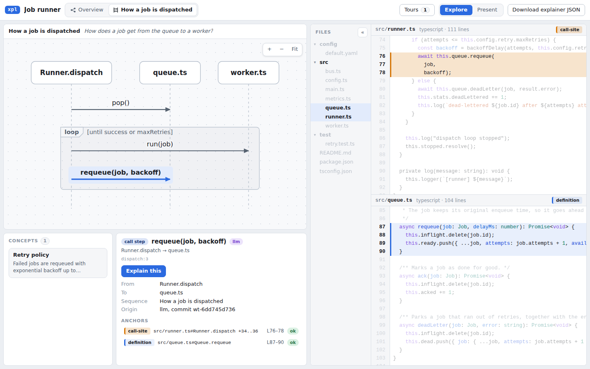
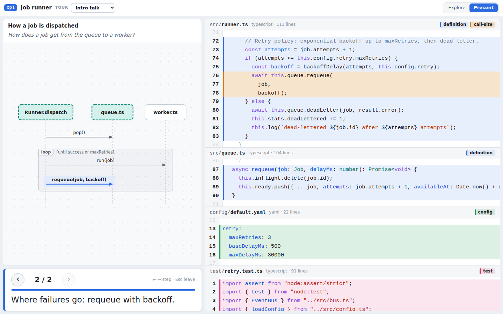
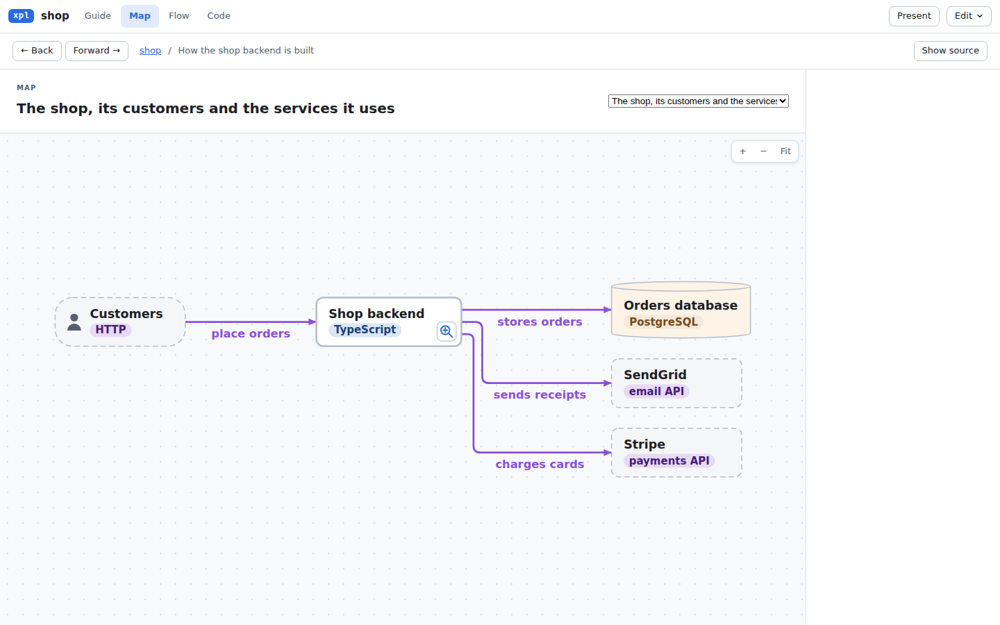
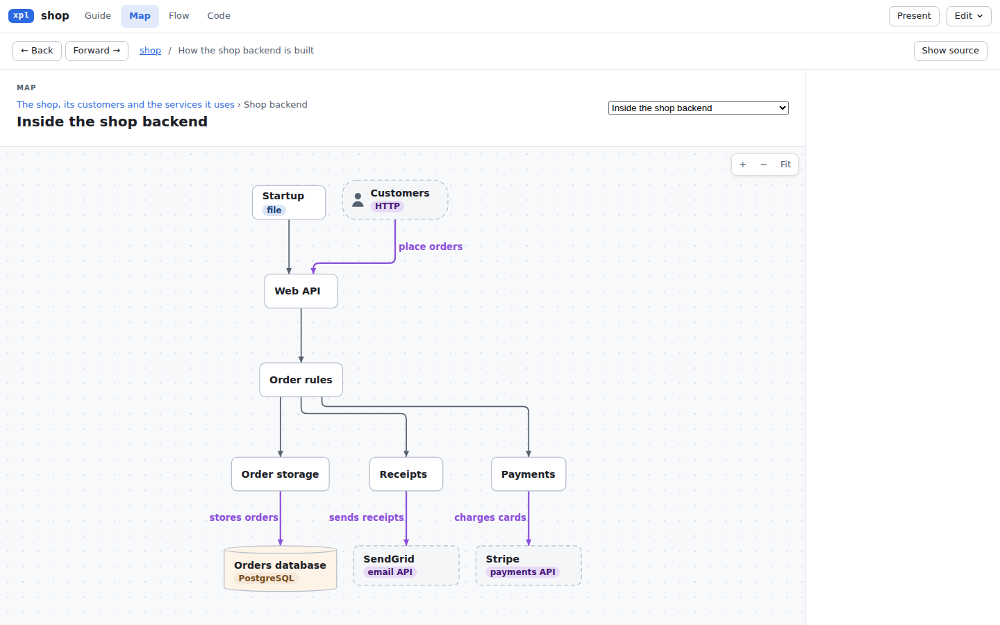

# xpl — code explainer

Interactive diagrams linked to code in both directions. Click a box, an arrow, a sequence step or a concept
and the editor highlights exactly the code it is about, across as many files as it touches, everything else
dimmed. Put the cursor in the code and the diagram elements and concepts that cover that line light up.
Claude writes the explanation as data, checked against a static index of your repo so it cannot point at
code that is not there; a fixed viewer renders it, live or as one HTML file you can share or present.
The page opens on a guide: a short summary, then the steps, each with a picture and its code. For a change
(a PR or a branch), it also shows the diff, and claims about the old code are checked against the base commit.





## Quick start

Needs Node 22.12 or newer and npm for installation. The local artifact is exercised on Linux x64
(WSL2, Node 22.23.1). Other platforms have not been verified. This workflow uses a local
`xpl-cli-0.0.0.tgz` from a maintainer; the publication target and release channel are undecided.

XPL helps an author publish a focused explanation of code. Choose a reader and a question before
drafting. Readers can check the linked source and tests; a valid anchor checks a location and
freshness, while the author remains responsible for the explanation's claims and omitted behavior.

```sh
npm install --global --prefix "$HOME/.local" --offline --ignore-scripts /absolute/path/xpl-cli-0.0.0.tgz
export PATH="$HOME/.local/bin:$PATH"
xpl doctor                                    # runtime, artifact hashes, grammars and optional tools
xpl skill install                             # copies the bundled skill and binds its launcher
xpl doctor --agent claude                      # also checks the skill and Claude Code availability
```

No source checkout or build is needed to install. After installing a newer tarball, rerun `xpl skill install`
to update the skill and its launcher. The launcher records the installed CLI's absolute path; rerun the
installer after moving the CLI. For one project, use `xpl skill install --dir .claude/skills/code-explainer`.
The installer refuses to overwrite a symlink, an unmanaged skill or local edits: move the old directory
aside to preserve it, then retry. Claude Code needs its own installation, authentication and provider
access. In a TypeScript, Python or Go repository, explicitly ask it:

```
/code-explainer explain How does X work? Root: /absolute/path/to/repo. Audience: maintainers. New guide: subsystem-guide.
```

For the three creation scopes and safe retries, see [Create a guide](skill/code-explainer/reference/create.md).
Choose a new guide or name the existing guide to extend; an existing file is never replaced by creation.
The agent writes and checks the JSON patch for you.

Claude indexes the repo, writes `.explainer/<name>.explainer.json` (commit it; the indexes beside it are
git-ignored) and gives you the result. Open it yourself with `xpl bundle <name> -o <name>.html` (one
self-contained file that carries the source files the explainer shows: works offline, easy to share;
`--files boundary` adds the callers, callees and tests around them, `--files all` every file of the repo) or
`xpl view <name>` (a local server with live repo access: your edits are saved and "Explain this" clicks are
queued for Claude). Other things to ask for: `explain this repo`, `explain change main...HEAD` (a PR or a
branch), `expand <node>`, `make a tour` (Present mode: arrow keys step through it). More in
[skill/code-explainer/README.md](skill/code-explainer/README.md).

Reading, `xpl index --precise off`, local viewing and HTML export use bundled assets without hosted xpl
infrastructure after installation. `xpl index` defaults to optional precise tools: npm/Go tool bootstrap,
toolchains and repository dependencies can need network access. Use `--precise off` offline; heuristic
references stay labeled as hints. `--precise require` fails if precise analysis cannot run. Authoring
through Claude Code has separate provider network requirements. `doctor` runs local version checks;
it does not download precise tools or verify agent authentication. No resident generation worker is needed.

In the viewer, Guide tells the story, Map shows relationships, Flow follows steps, and Code opens
source. Present plays a tour with arrow-key navigation. "Explain this" queues feedback; run
`/code-explainer feedback` in Claude Code to process it. Applied explanations, source changes and
new indexes refresh in a live viewer; a saved HTML page stays at its exported version. Unsaved edits
postpone live refresh. Reindex changed code to restore reliable source locations and references.

No Claude at hand? The source repository's fixtures ship example explainers (fixtures are not in the tarball):

```sh
cp -r fixtures/ts-jobrunner /tmp/jobrunner && cd /tmp/jobrunner
xpl index && xpl view jobrunner    # http://127.0.0.1:4747
```

## Using the CLI directly

Run these inside the repository you want to explain (or pass `--root <dir>`); every command takes `--json`.
The ids are those of the TS fixture from the quick start.

```sh
xpl index                                       # symbols and references -> .explainer/index-<commit>.json
xpl outline --depth 2                           # dirs, files, symbols: exact ids, line ranges, fan-in/out
xpl show src/runner.ts#Runner.dispatch --refs   # code with the 0-based offsets anchors use, and its calls
xpl refs src/queue.ts#Queue.requeue --in        # who calls it (hops through interfaces)
xpl new myrepo --title "My repo"                # .explainer/myrepo.explainer.json, bound to the index
xpl draft repo myrepo --audience "New maintainers" --question "How does this project work?" -o /tmp/draft.json
xpl lint myrepo --patch /tmp/draft.json          # write each TODO and check the reader text
xpl apply myrepo /tmp/draft.json                 # check and merge the patch: all or nothing
xpl validate myrepo                             # every id and anchor still resolves?
xpl lint myrepo                                 # plain-language, tour and reader checks (exit 1 on any; --warn-only)
xpl view myrepo                                 # http://127.0.0.1:4747 (falls back to a free port)
xpl ready myrepo                               # check source, required text and reader findings
xpl bundle myrepo -o myrepo.html                # one self-contained HTML file (--files boundary|all; --tour <id>)
```

`xpl search`, `xpl anchors`, `xpl resolve` (after the code changed), `xpl status` (what still needs
explaining), `xpl change` and `xpl draft change|path` (below) complete the set:
[skill/code-explainer/reference/cli.md](skill/code-explainer/reference/cli.md).
The format of `patch.json`: [skill/code-explainer/reference/patch-format.md](skill/code-explainer/reference/patch-format.md).

Drafts are provisional. Import lines suggest dependencies and architecture roles; review the primary
users and entry points. Path drafts select direct call sites in source order and list capped or
collapsed targets. Check conditions, loops and callback execution before describing a runtime flow.
In heuristic indexes, function values and callback registration are `read` references; invocation is a `call`. Reads are
available through `xpl refs` and the Map edge filters without creating recursion or execution steps.

Strict validation and ready export require a current index, even with `XPL_SKIP_STALE_CHECK=1`.
After changing code, run `xpl index`, `xpl resolve myrepo --write`, review the drift, and rebuild
the affected explanations before validating and bundling. `validate --lenient` supports repair work;
`xpl ready myrepo --json` reports source, structural, required-content and reader findings. Ready export
refuses before writing when required text is unfinished or source links are broken. Reader warnings invite
author judgment; `--note "reason"` records intentional omissions or warnings in the report and HTML.
`bundle --draft` writes a labelled preview for repair; `--allow-drift` is a legacy draft flag against a current
index. Edit > Save as HTML uses the same rules, with separate ready and draft actions. Offline re-saves check
only included source, and say they cannot detect later repository changes. Source checks do not verify prose
claims or every runtime path.
Generated XPL HTML pages are excluded from indexing, so exporting inside a repo does not stale its index.

### Explaining a change

A change explainer describes the head of a PR or a branch, and records the diff from git. Check out the
head first: the index must be built from it.

```sh
xpl index                                       # index the head
xpl new myrepo-pr-42 --title "PR 42: what it does"
xpl change myrepo-pr-42 main...HEAD             # record the diff; print changed symbols, callers, tests
xpl show --at base src/queue.ts --lines 80-95   # the old code, with the offsets a base anchor uses
xpl draft change myrepo-pr-42 -o /tmp/pr-42.json   # map, anchors, a review-order tour; fill in every TODO
xpl lint myrepo-pr-42 --patch /tmp/pr-42.json   # nothing written; fix what it reports
xpl apply myrepo-pr-42 /tmp/pr-42.json
xpl bundle myrepo-pr-42 -o pr-42.html --files boundary   # before and after, callers, callees, tests
```

Keep patch files outside the repo: a new file there makes the index stale. `main...HEAD` starts from the merge
base; `A..B` takes two commits. A "before" claim is anchored in the old code with `"at": "base"` (and `find`,
or a span from line 1 of the base file), so `xpl validate` checks it like any other claim. The viewer shows
added and removed lines, a "Before" pane, New and Changed badges on the map, and the list of changed files.

### Architecture maps

An overview starts at the top, like the C4 model: a system map with your service, who uses it, and what it
relies on (databases, caches, queues, other systems' APIs, each drawn with its own shape), then the inside of
each service (its parts, and which part talks to which outside system), then the code. A box with `opens`
zooms into the next level, or shows that level inside itself on the same map; a trail above the map leads
back up. Every box has an icon for what it is: a person, a service, a component, a database, an outside
system, or a folder, a file, a class or a function. `xpl draft repo` drafts both levels and finds
the outside systems from the import lines. The text follows the same order: what each part is for, in plain
words, before any code name (`xpl lint` flags notes that are long or lean on code names).





## Languages and precision

TypeScript/JavaScript, Python and Go get symbols and references. YAML, JSON and TOML get their keys as
symbols (`config/default.yaml#retry.maxRetries` or `pyproject.toml#project.scripts.flask` can be anchored like
a function). Rust has experimental syntax tags for named declarations and lexical nesting, with no resolved
relationships. Its tags provider runs with `--precise off` and needs no Rust toolchain; see
[the Rust experiment](docs/rust-tags.md) for coverage, measurements and commands. Any other text file is indexed as
plain text. The built-in language packs get symbols from tree-sitter (WASM, nothing to install); generated
SCIP artifacts can supply source-checked symbols too. References (calls, imports, inheritance, type uses, reads of variables and fields) come from a
scope-aware heuristic resolver, or, when the tool can run, from a compiler-grade SCIP indexer. `xpl index`
tries SCIP by default and prints what each language got: `refs: precise (scip-go@0.2.7)` or `refs: heuristic`.
The viewer draws heuristic edges lighter, and Claude treats them as hints.

`xpl index` also reports analysis coverage: file anchors, named symbols, full declaration ranges,
nesting, and each relationship kind independently. Saved indexes and exported viewers retain the
analyzed files, limits, and failures. Open **Analysis coverage** below the viewer's header for details.
Empty relationships do not mean complete analysis. Older indexes still load, with coverage shown as unknown.

| Language         | Precise references need                                                             |
| ---------------- | ----------------------------------------------------------------------------------- |
| TS / JS          | `npx` and, on first use, network access: `scip-typescript` 0.4.0                    |
| Python           | `npx` and, on first use, network access: `scip-python` 0.6.6                        |
| Go               | Go 1.25 or newer, or an older `go` that may download the toolchain: `scip-go` 0.2.7 |
| Rust             | nothing: syntax declarations only; relationships are unavailable                    |
| YAML, JSON, TOML | nothing: keys are symbols, there are no references                                  |

`--precise off` skips SCIP (fast, heuristic), `--precise require` fails instead of falling back;
`XPL_SCIP_TIMEOUT_MS` sets the per-tool timeout (default 10 minutes). Files a tool did not describe (build-tagged
Go files, for one) keep their heuristic references and are named in a warning; the summary then reads
`refs: precise 10/11 (scip-go@0.2.7), 1 heuristic`.

Repeated `xpl index` builds reuse file-local tree-sitter and Rust tags extraction in `.explainer/cache`.
Discovery, source hashes, heuristic resolution and semantic tools still run on every build. The summary
reports extraction hits/misses and wall time separately from fresh resolution and semantic work.
`xpl index --no-cache` reads and writes no cached facts; removing `.explainer/cache` reclaims old entries.
Cache directory aliases into the repository (symlinks or bind mounts) bypass reuse and report why.
See [cache keys, equivalence checks and measurements](docs/extraction-cache.md).

`xpl index --scip <artifact|manifest.json>` imports generated SCIP declarations and supported references,
including sources without a language pack (their language stays `text`). Documents need embedded source text
or an artifact-bound manifest of pre-generation source hashes. Missing full ranges, parents and call
classification remain explicit limits. Partial artifacts keep existing syntax symbol sets; a range-less
artifact can attach supported references to source-checked syntax symbols but cannot create declarations.
Standalone imports without checked targets report `refs: none` and fail under `--precise require`. See the [artifact workflow](skill/code-explainer/reference/cli.md#generated-scip-artifacts).

The built-in TS/JS, Python, Go and configuration paths have maintained language packs and acceptance tests.
Rust tags and the [Java workflow](docs/java-scip.md) are **experimental**, tested on jobrunner fixtures and
pinned bat/Gson repositories. Those bounded checks do not establish production maturity across either
language's build ecosystems. Java requires an explicitly generated artifact and a working JDK/Maven build;
it retains checked declarations and type references, while calls and inheritance remain unsupported.
Java stays plain text: use explicit views and `search` without `--code`.

The [language-support decision](docs/assessment-2026-10-04-language-support.md) compares both producers on
the same Rust sources and records the next slices. Use `--precise off` for Rust today. The pinned
rust-analyzer SCIP producer omits full declaration ranges; importing it can erase valid Rust tags and
still pass `--precise require` with no semantic edges. It is an investigation path, not supported Rust
precision. Its cached offline run needs a build-script override; a cold offline prep run crashed.
Missing semantic tools or failed builds require a fresh successful artifact. Java's `--precise off`
fallback keeps file anchors and config symbols, without Java named symbols or relationships.

Precise is not free on a big repository: on django (2,900 Python files) it took 4 minutes and 4.6 GB, on
sympy and prometheus 9 to 10 minutes and up to 7 GB, where `--precise off` took 15 to 40 seconds. The heuristic
references agree with SCIP on 97 to 99.9% of the calls both find (see
[the stress test](docs/review-2026-10-03-stress.md)), so start a big repository with `--precise off` and index
precisely when the answer depends on generics, untyped parameters or narrowing. Where a SCIP tool is wrong or
blind (a re-export it misnames, generated code with `//line` directives), the heuristic reference is kept.

## Repository layout

| Path                   | What                                                                                                     |
| ---------------------- | -------------------------------------------------------------------------------------------------------- |
| `packages/core`        | `@xpl/core`: schema types and pure logic (anchors, graph derivation, validation, patches). Browser-safe. |
| `packages/indexer`     | `@xpl/indexer`: file discovery, tree-sitter (WASM) language packs, heuristic resolver, SCIP import.      |
| `packages/cli`         | `@xpl/cli`: the `xpl` command, bundled to `packages/cli/dist/xpl.mjs`.                                   |
| `packages/viewer`      | `@xpl/viewer`: React + CodeMirror 6 + dagre, built to one `index.html`.                                  |
| `skill/code-explainer` | The Claude skill: `SKILL.md`, quick, CLI, patch and writing references, worked examples, launcher.       |
| `fixtures/`            | Tiny real repos (a job runner in TS, Python and Go) with committed explainers.                           |
| `docs/`                | Architecture, the original design brief, dated review reports, images.                                   |
| `.explainer/`          | xpl's own explainer (`xpl.explainer.json`), committed; its indexes are git-ignored.                      |
| `AGENTS.md`            | Guidance for coding agents; project skills in `.claude/skills/`.                                         |
| `scripts/`             | Before/after screenshots for a pull request: `needs-screenshots.sh`, `pr-screenshots.sh`, publishing.    |

## Development

```sh
npm install          # dependency install scripts are disabled on purpose, see .npmrc
npm run typecheck    # tsc --noEmit in every package
npm test             # vitest: unit tests of all packages (packages/*/test)
npm run build        # viewer (Vite single file) first, then the CLI bundle
npm run pack -- --pack-destination /tmp         # build and pack the standalone CLI, viewer, grammars and skill
npm run test:install -- /tmp/xpl-install        # install the tarball offline and exercise its CLI and reader
npm run test:e2e     # builds the viewer, then Playwright on fixture bundles made from dist/index.html
XPL_TEST_SCIP=1 npx vitest run packages/indexer/test/scip-integration.test.ts   # real SCIP indexers
npm run format       # prettier --write . (format:check to verify)
```

Workspace packages export their TypeScript sources; vitest, tsx and vite read them directly, so there is no
build step between packages in development. After `npm run build`, `node packages/cli/dist/xpl.mjs __smoke`
(hidden) loads every tree-sitter grammar from `dist/wasm`.

The workspace packages stay private. The build writes standalone npm metadata in `packages/cli/dist`
with the CLI package's version and no install dependencies or scripts. `npm run pack` packs that directory,
not the workspace package. `integrity.json` records SHA-256 hashes for bundled files; `doctor` detects
missing or changed files. These hashes detect damage, not the identity of an artifact's publisher.
The install check copies fixture inputs to scratch, denies CLI checkout reads with Node permissions,
and tests TS/Python/Go indexing, local viewing and disconnected HTML reading with pinned Chromium.

- The tree-sitter grammars are the `.wasm` files shipped inside their npm packages (versions pinned exactly:
  the wasm ABI has to match `web-tree-sitter`). Use `initParser()` / `loadLanguage()` from
  `packages/indexer/src/wasm.ts`, never `Parser.init()`. `XPL_WASM_DIR` redirects the wasm files.
- Playwright must match the browsers preinstalled in `PLAYWRIGHT_BROWSERS_PATH` (`/opt/pw-browsers` in the
  sandbox), hence `@playwright/test@1.56.1`. Do not run `playwright install` there. The e2e run rewrites the
  screenshots in `packages/viewer/e2e/screenshots/` (git-ignored); the first two images above are copies of
  `dispatch-step-selected-light.png` and `tour-step-2-light.png` in `docs/images/`. The two architecture map
  images are not made by the e2e run.
- `.npmrc` sets `ignore-scripts=true`, so npm also skips `pre*`/`post*` scripts of our own packages.
- Fixture line numbers are load-bearing (anchors, acceptance tests): prettier ignores `fixtures/`.

## Docs

- [AGENTS.md](AGENTS.md): the guide for coding agents working on this repo (commands, invariants, PR rules),
  with project skills in `.claude/skills/`.
- [docs/ARCHITECTURE.md](docs/ARCHITECTURE.md): how it is built: schema (change records and base anchors
  included), indexer, anchors and patches, CLI (`change`, `draft`, `lint`) and server API, viewer (Read,
  Explore, Present, the diff view), known limitations.
- [docs/handoff.md](docs/handoff.md): the original design brief (schema draft and worked example).
- [docs/review-2026-10-01.md](docs/review-2026-10-01.md): review of four generated explainers (two PRs,
  a whole repo, a subsystem), what that iteration changed, a validation run on an unseen PR, and the
  roadmap.
- [docs/review-2026-10-03-ui.md](docs/review-2026-10-03-ui.md): a UI review of the viewer on the fixture
  bundles (five personas, screenshots at five widths), what was changed, and a second round on the open items.
- [docs/review-2026-10-03-real-runs.md](docs/review-2026-10-03-real-runs.md): the skill, CLI and viewer on
  three unseen projects (ky, itsdangerous, chi) at four levels (system, feature, algorithm, change), with the
  persona reports and authoring logs in [docs/review-2026-10-03-real-runs/](docs/review-2026-10-03-real-runs/).
- [docs/review-2026-10-03-stress.md](docs/review-2026-10-03-stress.md): a stress test on seven large repositories
  (zod, vue, django, sympy, jinja, prometheus, hcl) and on recursive edge cases: accuracy, speed, what was fixed
  and what is still open.
- [docs/assessment-2026-10-04-graph-formats.md](docs/assessment-2026-10-04-graph-formats.md): SCIP, Kythe and
  Joern CPG artifacts of the Go fixture mapped through the provider contract, what each loses, and why only SCIP
  gets an importer; reproducible with the scripts beside it.
- [docs/analysis-2026-09-30.txt](docs/analysis-2026-09-30.txt): an earlier analysis of the project (plain text).
- [skill/code-explainer/](skill/code-explainer/): what Claude reads: `SKILL.md`, `reference/` (the one-page
  quick reference, the CLI, the patch format, the writing rules, the guide for changes, and two worked example
  patches in `examples/`).
