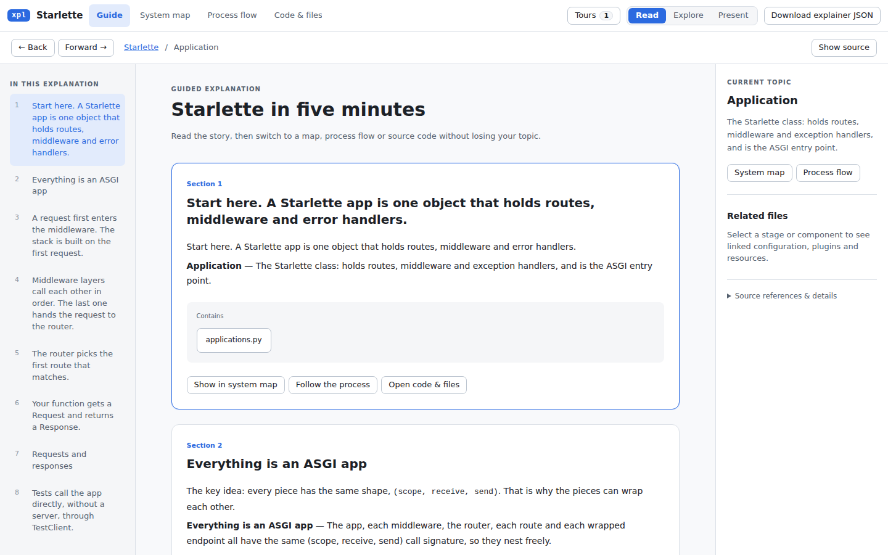
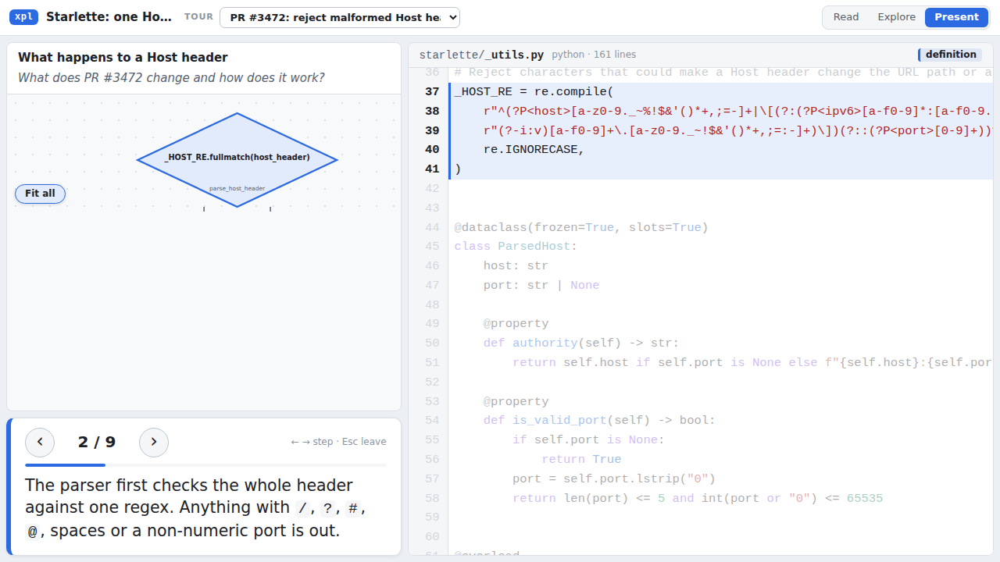
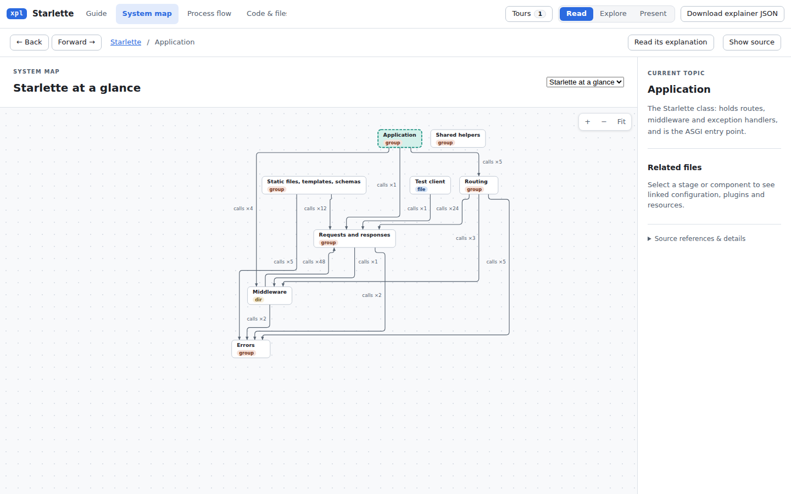
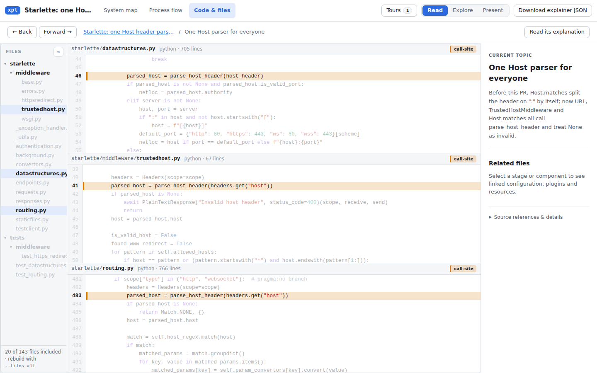

# Review of generated explainers, 2026-10-01

Reviewed: `main` at `5e57787`. This report covers what readers get. For the tool's own correctness,
see [analysis-2026-09-30.txt](analysis-2026-09-30.txt).

## 1. Summary

The explainers made with the old skill did not do their three jobs. A reviewer would go back to the
plain diff. A newcomer and a manager rated the language 2 of 5. A presenter would not take them into
a meeting. Claims about the current code were mostly right, and the Present captions were good.

1. **Accuracy.** 92 of 140 claims (66%) were fully correct. Every wrong or unanchored claim was
   about the code _before_ a PR.
2. **No summary, too many layers.** One sentence appeared 3-5 times on a screen.
3. **Change review lacked the basics:** no diff, no changed-file list, no callers of changed code,
   no test gaps.
4. **Language and order.** Code as headings, undefined terms, tours that started in the details.
5. **Too much UI, too small.** Diagram text was 9-12 px. The Present diagram failed in about 14 of
   18 steps.

This iteration rewrote the skill, made the viewer reader-first, and added `xpl lint` and a boundary
bundle. On an unseen PR the new skill made 0 wrong claims, and its language rated 4 of 5 (section
5). The diff is still missing; it tops the roadmap.

## 2. What we did

We made four explainers with the skill as it was, on local checkouts. Nothing was posted to any
repository.

| Run            | Scope             | Target                                                                   |
| -------------- | ----------------- | ------------------------------------------------------------------------ |
| pr-starlette   | PR/MR             | Starlette PR #3472, Host header parsing (9 files, +203 / -15)            |
| pr-hono        | PR/MR             | Hono PR #5311, `q=0` in Accept headers (4 files, +108 / -7)              |
| arch-starlette | Whole project     | "Explain this repo", then "make tour"                                    |
| part-starlette | Part of a project | A request through middleware and router, and how errors become responses |

Five reviews followed. Four were personas: a newcomer, a PR reviewer, a presenter and a manager. An
auditor checked 140 claims against the code, and ran the base and head where reading was not enough.
Prior-art research covered tools, writing guides and code-review studies (section 6). References
such as "newcomer §3" point to those reports, which are not in the repository.

**Changed in this iteration:**

- **Skill.** Three scopes, including a new read-only `explain change <base>..<head>`. Every tour has
  a `summary` and `###` step titles, and goes top-down. For a change the order is behaviour, entry,
  changed pieces, who else, tests, risks. New `reference/writing.md` and
  `reference/explain-change.md`, with examples on the job-runner fixtures. Accuracy rules: check
  "before" claims in the base code, name guard conditions, give evidence for "all". Rules for the
  boundary, maps and cheap single-element edits. It ends with `xpl lint` and a newcomer
  read-through.
- **Core and viewer.**
  - Tour `summary` field, shown first in the Guide.
  - One step title everywhere, from the `###` line, not repeated in the body.
  - Say it once: no focus summaries under a note, no "Current topic" next to an open section, no
    empty Related files.
  - Reader header: Guide / Map / Flow / Code, Present, and one Edit menu (Explore, tour editor,
    Download JSON). It fits at 1280 px. No internal words for readers.
  - Present: text at least 12 px, flows fill the pane, sequences frame the focused step, code opens
    at the first range, long captions fit. `calls ×N` labels show only on hover or selection.
  - The Process flow crash is fixed.
  - Element summaries now render inline markdown defensively, so a stray `**Changed:**` shows as
    bold. `xpl lint` still asks for plain text in those fields.
- **CLI.** `xpl lint`: tour summary, `###` titles, code and placeholder titles, sentence length,
  bare "It"/"This", filler and absolute words, repeats, code as flow labels, markdown in plain
  fields. `xpl bundle --files boundary` with `--boundary-max`. A fix for the false stale-file
  warning from `xpl show file:`.

## 3. Findings

**Done** means done in this iteration. **Proposed** means it is in the roadmap (section 4).

### 3.0 Accuracy

| Explainer      | Claims | Correct  | Imprecise | Overstated | Unanchored | Wrong  |
| -------------- | ------ | -------- | --------- | ---------- | ---------- | ------ |
| pr-starlette   | 40     | 25       | 6         | 2          | 4          | 3      |
| pr-hono        | 27     | 19       | 2         | 3          | 3          | 0      |
| arch-starlette | 27     | 18       | 7         | 2          | 0          | 0      |
| part-starlette | 46     | 30       | 13        | 3          | 0          | 0      |
| **All**        | 140    | 92 (66%) | 28 (20%)  | 10 (7%)    | 7 (5%)     | 3 (2%) |

Recurring causes [accuracy]:

- "Before" claims have no anchor. They account for all 3 wrong and all 7 unanchored rows, and
  `validate` still said "ok".
- The guard condition above the anchored lines gets dropped.
- Titles carry slogans, such as "the same way everywhere".
- Short lists read as complete.
- Folklore stands in for code, such as "built on the first request".

The viewer shows each claim next to its code, so a wrong claim looks checked.

| Improvement                                                                           | Status   |
| ------------------------------------------------------------------------------------- | -------- |
| Skill: "before" claims checked in the base code; guard conditions; evidence for "all" | Done     |
| `xpl lint`: absolute words and slogans                                                | Done     |
| Base-commit anchors (`xpl show --at <base>`), checked by `validate`                   | Proposed |
| Independent accuracy pass for change explainers                                       | Proposed |
| Flow boxes named after the step's actor, not its `to` participant                     | Proposed |

### 3.1 Goal 1: information where people look

**Evidence.** Under the title sat only a fixed hint. pr-starlette's user-visible change came in
steps 7-8 of 9. The best answer, the error flowchart, crashed in Read > Process flow (`x11`).
**Why.** What comes first signals what matters ([progressive disclosure][nng-pd], [inverted
pyramid][nng-pyramid]).

| Improvement                                                    | Status   |
| -------------------------------------------------------------- | -------- |
| Tour `summary`, written by the skill and shown first           | Done     |
| Process flow crash; header fits at 1280 px; empty panel hidden | Done     |
| Diagram inline in the guide, current step highlighted          | Proposed |
| Tests in one place, not scattered in the right rail            | Proposed |

### 3.2 Goal 2: fewer things at the same level

**Evidence.** About 15 kinds of box for an 8-step story. The contents, heading, note, focus
summaries and "Current topic" repeated one sentence [newcomer §3]. No field held the why. **Why.**
Tutorial, reference and explanation are different modes ([Diátaxis][diataxis]); CodeTour marks one
tour as primary ([CodeTour][codetour]).

| Improvement                                                           | Status   |
| --------------------------------------------------------------------- | -------- |
| `###` title used once; no repeated summaries or "Current topic"       | Done     |
| Skill: one primary tour, 0-3 concepts; lint flags a note that repeats | Done     |
| Three levels: Summary, Guide, Reference (map, flows, code, glossary)  | Proposed |
| Concepts as glossary terms; no self-call chips ("X → X")              | Proposed |

### 3.3 Goal 3: plain language

**Evidence.** Rated 2/5 by the newcomer and the manager. Headings were code
(`_HOST_RE.fullmatch(host_header)`) or broken splits ("Fix 1", "Note"). ASGI was never defined.
Starlette was never called a Python web framework. **Why.** Aim for 15-20 words per sentence and
define every term ([OPM][opm], [Google style][google-style]). Models miss this unless told, so rules
need a check ([NN/g][nng-genai]).

| Improvement                                                     | Status   |
| --------------------------------------------------------------- | -------- |
| `reference/writing.md` with rules and 8 rewrites                | Done     |
| `xpl lint` for the mechanical rules; plain UI text              | Done     |
| One-line glossary of terms used everywhere (`scope`, `receive`) | Proposed |

### 3.4 Goal 4: top-down order

**Evidence.** arch started in `Starlette.__init__` and covered 4 of 8 map boxes. part put an edge
case before the main path. pr-starlette reached parser internals before the change users see.
**Why.** Zoom one level at a time ([C4][c4], [Pennington][pennington]). Code shown last gets fewer
review comments ([Fregnan et al.][fregnan]).

| Improvement                                                      | Status   |
| ---------------------------------------------------------------- | -------- |
| Summary first, then down one level at a time, edge cases last    | Done     |
| Review order for a change; a repo tour covers every overview box | Done     |
| `xpl lint` checks order (every box covered, edge cases last)     | Proposed |

### 3.5 Goal 5: faster, cheaper, editable, composable

**Evidence.** Presenter edits are lost on reload, and step titles or code cannot be changed in the
file [presenter §4]. Roughly 70% of the JSON is structure, not text. Fixing one note means resending
the whole tour; one validation run did it 5 times. **Why.** Patch, do not regenerate
([Aider][aider], [str_replace][anthropic-edit]); one model, many views ([Structurizr][structurizr]).

| Improvement                                                       | Status   |
| ----------------------------------------------------------------- | -------- |
| Skill: cheap single-element edits                                 | Done     |
| Tour `stepsUpdate`; `xpl lint` on a patch before `apply`          | Proposed |
| Scaffolds: `xpl draft change`, `xpl draft repo`, `xpl draft path` | Proposed |
| Edits saved into the HTML; one explainer per repo that grows      | Proposed |

### 3.6 Goal 6: a safe boundary

**Evidence.** pr-starlette left out one of the PR's changed test files, while 8 of its 20 files were
noise from stubs. No bundle held the base code. With `--files boundary`, every file of that PR is
now in. **Why.** "All callers now do X" can only be checked with the callers in the file.

| Improvement                                                                   | Status   |
| ----------------------------------------------------------------------------- | -------- |
| Skill: every changed file anchored, tests included                            | Done     |
| `xpl bundle --files boundary`: callers, callees and tests of anchored symbols | Done     |
| Base versions embedded; "not included" files listed with the reason           | Proposed |

### 3.7 Goal 7: UI density

**Evidence.** The manager could not place 19-24 items on the first screen. Diagram text was 9-12 px.
In Present, flows were drawn 150 px tall and sequences never moved to the focused step [presenter
§1]. **Why.** Defer secondary features, and use labels that say what is behind them ([progressive
disclosure][nng-pd], [information scent][nng-scent]).

| Improvement                                                                   | Status   |
| ----------------------------------------------------------------------------- | -------- |
| Reader header with one Edit menu; no internal words for readers               | Done     |
| Present: text at least 12 px, framing fixed (flow 150 → 363 px at 1280)       | Done     |
| `calls ×N` only on hover; no stubs on tour maps; at most 2 code ranges a step | Done     |
| One calm reader screen (the Present layout with longer text)                  | Proposed |
| Present code font scales with the screen; long lines wrap                     | Proposed |

### 3.8 By scope

**PR/MR.** There was no diff and no changed-file list, and stubs led to unrelated importers. The
biggest behaviour change was missed: `URL` consumers silently use the server address. The security
fix read as cosmetic [mr-reviewer]. Understanding the change is the main review challenge
([Bacchelli and Bird][bacchelli]). Good tools lead with a summary and group files by purpose
([CodeRabbit][coderabbit-walk]).

| Improvement                                                             | Status   |
| ----------------------------------------------------------------------- | -------- |
| `explain change`: before claims in the base, blast radius, tests, risks | Done     |
| A large change is split, or the parts left out are named                | Done     |
| Diff mode; base-commit anchors                                          | Proposed |
| Computed blast radius and tests table; New/Changed shown on the map     | Proposed |

**Whole project.** The guide never said what Starlette is. The 8-box map had type badges and
`calls ×N`, and showed nothing outside the code [manager §3].

| Improvement                                                       | Status   |
| ----------------------------------------------------------------- | -------- |
| Summary says what the project is; 4-8 boxes; the tour covers each | Done     |
| Context boxes (web server, "your code"); main path drawn thick    | Proposed |

**Part of a project.** It had the best order and the best sentences. It also had the most imprecise
claims (13 of 46), mostly dropped conditions.

| Improvement                                  | Status   |
| -------------------------------------------- | -------- |
| Guard-condition rule; Present framing fixed  | Done     |
| `xpl draft path <entry>` from the call graph | Proposed |

## 4. Proposed roadmap

Ordered by value, then effort (S, M, L). The first two are what a reviewer still misses.

| #   | Item                                                                                                                      | Why                                                                     | Effort |
| --- | ------------------------------------------------------------------------------------------------------------------------- | ----------------------------------------------------------------------- | ------ |
| 1   | **Diff mode**: base and head embedded, +/- gutter, changed lines marked, removed lines shown                              | The top gap in both PR reviews                                          | L      |
| 2   | **Base-commit anchors** (`xpl show --at <base>`), checked by `validate`                                                   | Run 3's 12 true "before" claims are still unanchored prose              | M      |
| 3   | **Tour `stepsUpdate`**: change one step without resending the tour                                                        | One run resent its tour 5 times                                         | S      |
| 4   | **Lint before apply**, order checks, fewer false positives                                                                | Each finding costs another apply                                        | S      |
| 5   | **Computed blast radius and tests table**, including calls through a variable                                             | The agent does it by hand, and run 3 missed an untested branch          | M      |
| 6   | **Independent accuracy pass** for change explainers                                                                       | It caught the 3 baseline wrong claims and run 3's wrong test conclusion | S      |
| 7   | **Change status on the map**; no self-call chips; flow boxes named by actor                                               | Only the text says what changed                                         | S      |
| 8   | **Scaffolds**: `xpl draft change`, `xpl draft repo`, `xpl draft path` build structure with no LLM; Claude writes the text | Roughly 70% of the JSON is structure; runs took 28-57 minutes           | L      |
| 9   | **Calm reader screen**: diagram inline in the guide, tour picker in Read, tests in one place                              | The guide still has no pictures                                         | M      |
| 10  | **Edits that stick**: "Save as HTML", editable step titles and code, "Ask AI to change this"                              | Presenter edits are lost on reload                                      | M      |
| 11  | **Content model**: Summary, Guide, Reference; concepts as glossary terms                                                  | The peer types remain                                                   | L      |
| 12  | **Reader-level maps**: context boxes, main path drawn thick                                                               | The manager could not tell where the system sits                        | M      |
| 13  | **Fast mode**: a map and a 5-step tour                                                                                    | A cheap first answer once item 8 exists                                 | S      |

## 5. Validation

Fresh agents regenerated explainers with only the new skill. Nothing was posted or pushed. They read
the base with `git show`, and ran it from a `git archive` copy outside the repo.

### Validation run

**Runs 1 and 2** repeated the earlier cases (PR #3472 and the request-path question). They found
skill bugs, which were fixed before run 3:

- `stubs` on flow views: this caused the only rejected patches.
- Test-case content inside the skill: the examples now use fixtures.
- Too much required reading: about 1,100 lines before the first patch.

**Run 3** used an unseen PR, Starlette #3523, which stops file transfers when a client disconnects.
An independent reviewer checked all 32 claims and re-ran the base and head.

| Measure                                               | Baseline (PR #3472) | Run 3 (PR #3523)   |
| ----------------------------------------------------- | ------------------- | ------------------ |
| Wrong claims                                          | 3                   | 0                  |
| Claims correct, strict                                | 62.5%               | 66%                |
| Correct, counting true "before" claims with no anchor | 72.5%               | 84%                |
| "Before" claims verified by running the base          | none; 2 of 5 false  | 12 of 12, all true |
| Language (1-5)                                        | 2                   | 4                  |
| Summary first                                         | no                  | yes                |
| Order                                                 | mechanism first     | top-down           |
| Same sentence repeated                                | 3-4×                | about 2×           |
| PR reviewer needs met (of 8)                          | about 1             | 6                  |
| Page errors                                           | 1                   | 0                  |

The baseline is a different PR, so this compares levels, not one experiment.

**Top remaining problems:**

1. **No diff in the bundle.** The reader must trust the "before" prose (roadmap items 1 and 2).
2. **A wrong test conclusion.** A test that passes on the base was said not to "guard this change",
   but it guards the new code. The skill now forbids that inference without evidence.
3. **Untested paths and the risk were not stated.** The skill now asks for each untested branch and
   the worst realistic failure.

## 6. Sources

Tools: [CodeTour][codetour], [CodeRabbit][coderabbit-walk], [Swimm][swimm], [Code Wiki][codewiki],
[C4][c4], [Structurizr][structurizr], [Graphite][graphite]. Writing and structure:
[Diátaxis][diataxis], NN/g on [progressive disclosure][nng-pd], [information scent][nng-scent], [the
inverted pyramid][nng-pyramid], [how users read][nng-read] and [genAI writing][nng-genai];
[OPM][opm]; [Google style][google-style]. Comprehension and review: [Pennington][pennington],
[Bacchelli and Bird][bacchelli], [Sadowski et al.][sadowski], [Fregnan et al.][fregnan], [Not One to
Rule Them All][not-one], [Barnett et al.][barnett]. Generation: [Aider][aider],
[str_replace][anthropic-edit], [structured outputs][anthropic-structured].

[codetour]: https://github.com/microsoft/codetour
[coderabbit-walk]: https://docs.coderabbit.ai/pr-reviews/walkthroughs
[swimm]: https://swimm.io/learn/code-documentation/reasons-continuous-integration-documentation-is-a-must
[codewiki]: https://www.theregister.com/2025/11/17/google_previews_code_wiki/
[c4]: https://c4model.com/
[structurizr]: https://docs.structurizr.com/as-code
[graphite]: https://graphite.com/docs/cli-quick-start
[diataxis]: https://diataxis.fr/
[nng-pd]: https://www.nngroup.com/articles/progressive-disclosure/
[nng-scent]: https://www.nngroup.com/articles/information-scent/
[nng-pyramid]: https://www.nngroup.com/articles/inverted-pyramid/
[nng-read]: https://www.nngroup.com/articles/how-users-read-on-the-web/
[nng-genai]: https://www.nngroup.com/articles/genai-write-for-the-web/
[opm]: https://www.opm.gov/information-management/plain-language/
[google-style]: https://developers.google.com/style
[pennington]: https://arxiv.org/pdf/cs/0612018
[bacchelli]: https://www.microsoft.com/en-us/research/wp-content/uploads/2016/02/ICSE202013-codereview.pdf
[sadowski]: https://sback.it/publications/icse2018seip.pdf
[fregnan]: https://arxiv.org/abs/2208.04259
[not-one]: https://dl.acm.org/doi/10.1145/3756681.3756961
[barnett]: https://cabird.com/pdfs/barnett2015helping.pdf
[aider]: https://aider.chat/docs/more/edit-formats.html
[anthropic-edit]: https://platform.claude.com/docs/en/agents-and-tools/tool-use/text-editor-tool
[anthropic-structured]: https://platform.claude.com/docs/en/build-with-claude/structured-outputs
