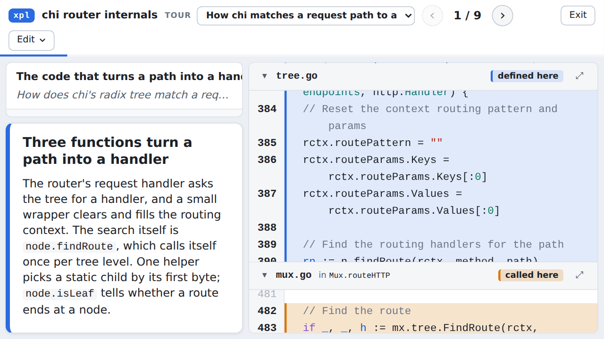
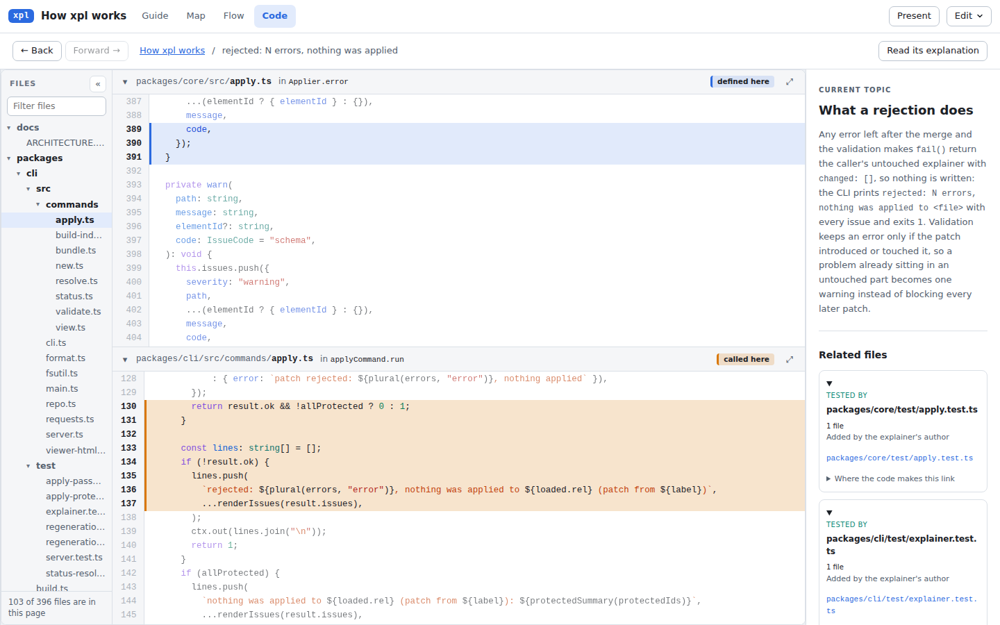
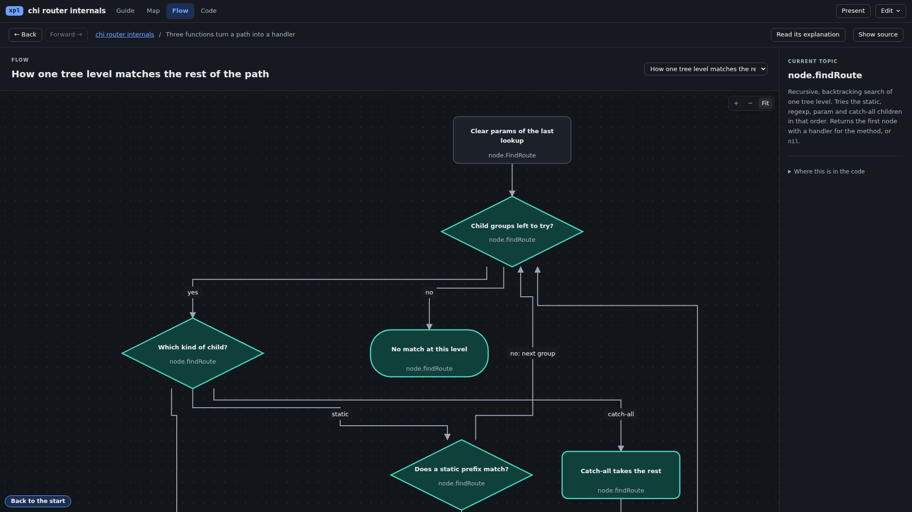
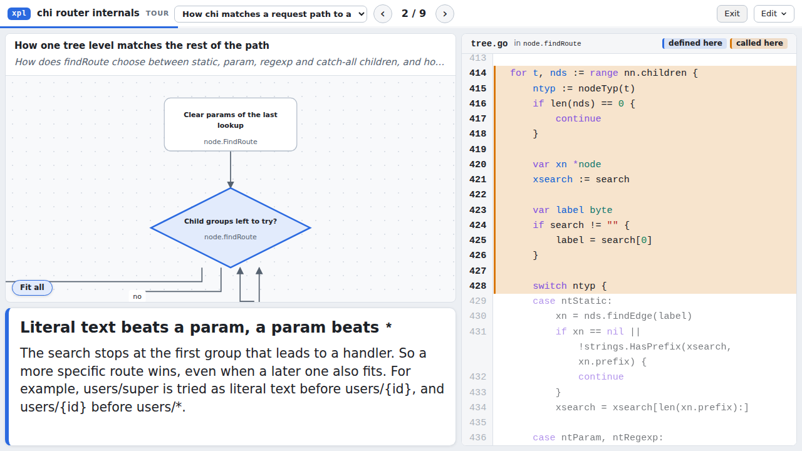
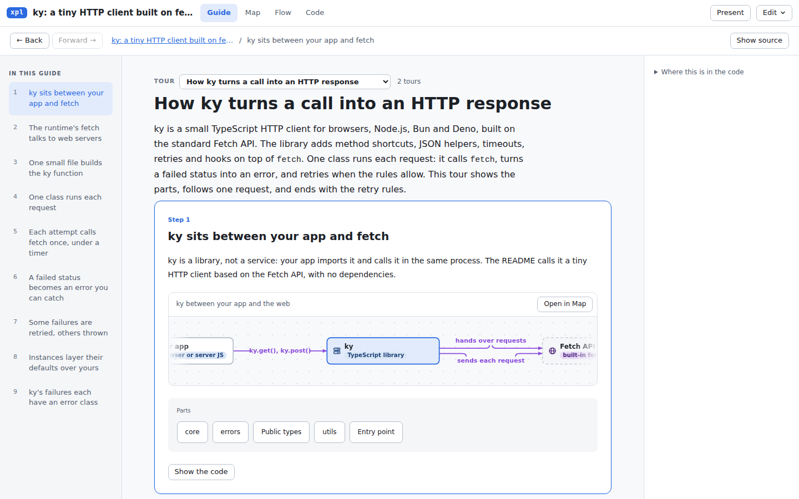
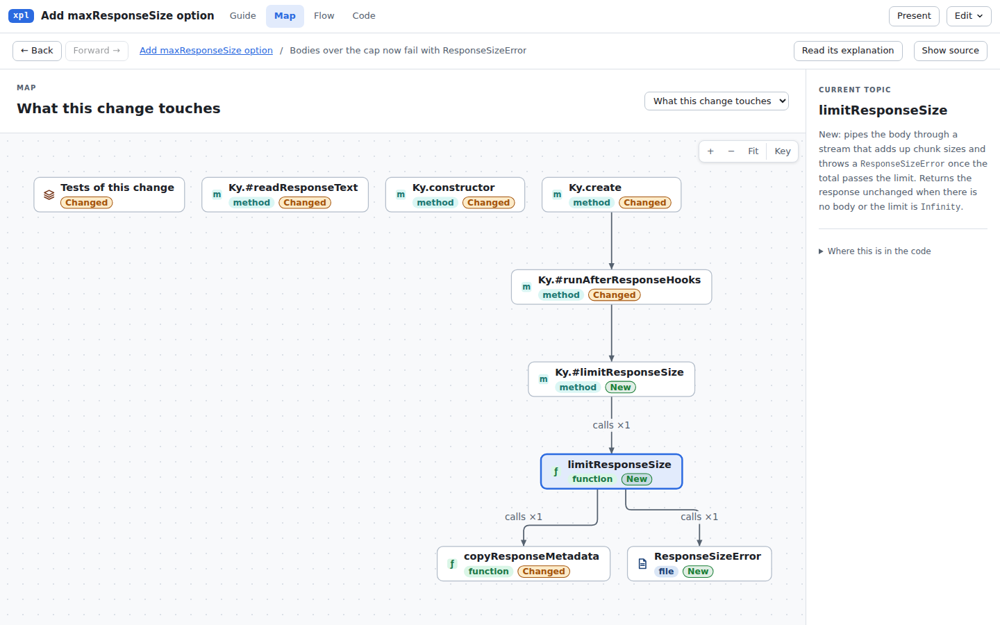
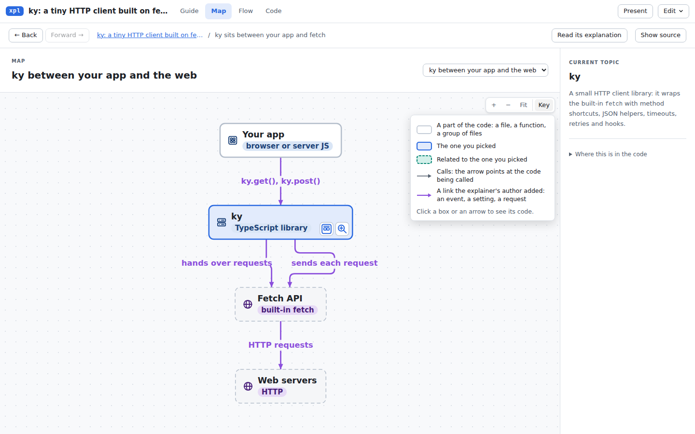
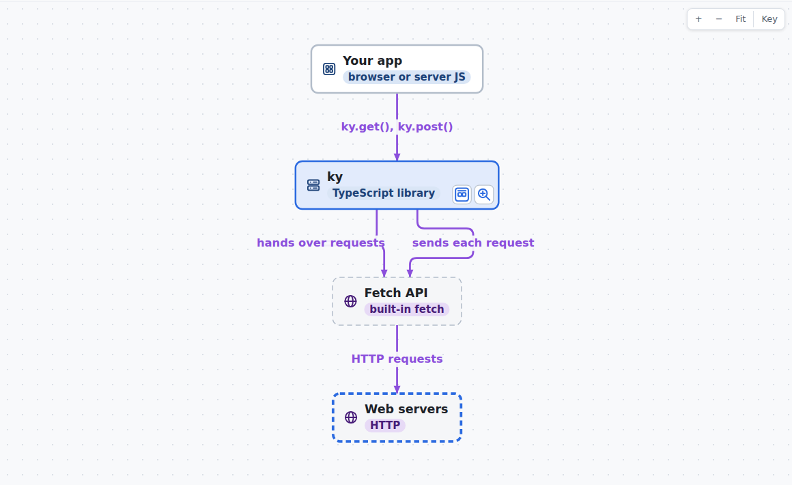
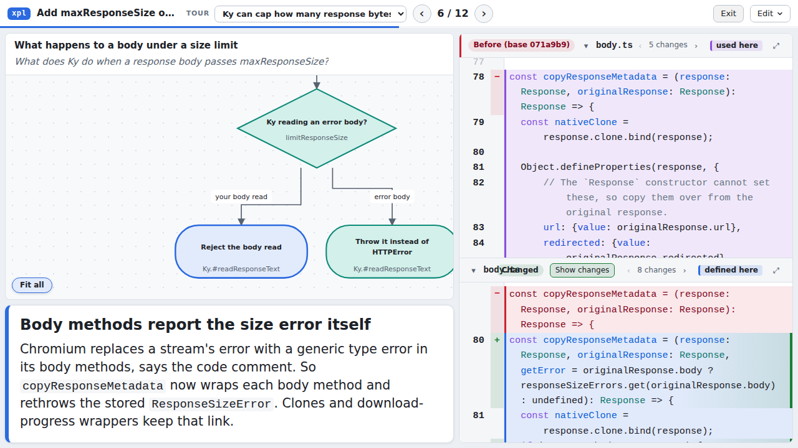
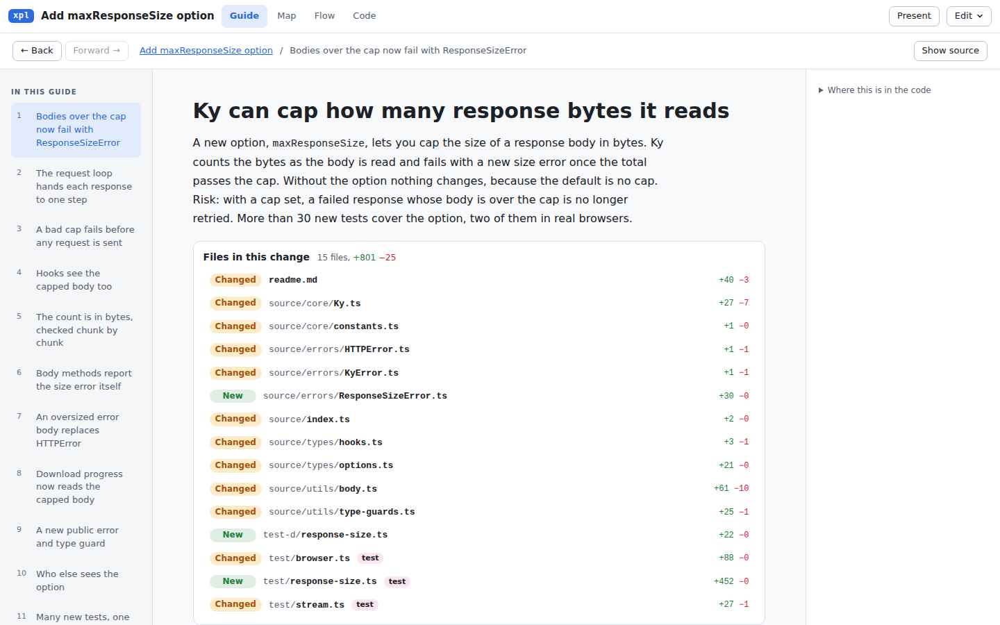

# UI/UX review on real runs, 2026-10-03

Reviewed: `main` at `fbc1126`. The skill, the CLI and the viewer, on three open-source projects xpl had never seen,
at four levels of abstraction. The [previous UI review](review-2026-10-03-ui.md) worked from the fixtures; this
one asks whether its fixes hold when the content is real.

## 1. Summary

The viewer is fast, and the code it shows is right where the explainer is fresh. Two kinds of reader got their
answer from the first paragraph: a reviewer deciding on a PR, and a manager. The weak parts are the
**pictures** and the **drafts**:

- **Pictures.** Guide pictures crop end boxes, render text at 6.5 px, or show one diamond of a flow. A 17-step
  flow never fits. Present at 150% browser zoom loses the diagram entirely.
- **Drafts.** Three of the four authoring runs rewrote the draft almost from scratch. At every level the drafts
  got the structure wrong.
- **Staleness.** The repo's own showcase explainer (`.explainer/xpl.explainer.json`) has drifted, and `xpl bundle`
  shipped it without a word. On 148 of 365 symbol anchors the viewer highlights the wrong lines and calls them
  "defined here".

Overall rating (1-5) by persona and level. A dash means that persona did not review that level.

| Persona                     | L1 system (ky) | L2 feature (itsdangerous) | L3 algorithm (chi) | L4 change (ky PR) | Big repo (xpl itself) |
| --------------------------- | -------------- | ------------------------- | ------------------ | ----------------- | --------------------- |
| Newcomer developer          | 3.5            | 4.5                       | –                  | –                 | 2.5                   |
| Staff engineer (skeptic)    | –              | 4                         | 3.5                | –                 | –                     |
| Maintainer reviewing a PR   | –              | –                         | –                  | 4                 | –                     |
| Presenter (1280×720)        | 4              | –                         | 2.5                | 3.5               | –                     |
| Manager (no code)           | 3.5            | –                         | 2                  | 4                 | 1.5                   |
| Designer and accessibility  | 3.5            | 3.5                       | 3.5                | 4                 | 3                     |
| **Mean**                    | **3.6**        | **4.0**                   | **2.9**            | **3.9**           | **2.3**               |
| Claude as author (the skill) | 3              | 4                         | 3.5                | 4                 | –                     |

The viewer suits **one feature (L2)** and **a change (L4)** best. It is weakest on **one recursive function (L3)**,
where the diagrams do not scale, and on the **big repo**, where the cause is stale content and code-label titles,
not size. Every presenter rating drops to 1.5 at 150% zoom.

## 2. What we did

**Real runs.** We built the CLI and cloned three repositories. Four Claude agents then followed
`skill/code-explainer/SKILL.md` as a user would, one request each, and each kept a log of every command, error and
lint round:

| Level                   | Project                     | Request                                                                                    | Result                                                                                         |
| ----------------------- | --------------------------- | ------------------------------------------------------------------------------------------ | ---------------------------------------------------------------------------------------------- |
| L1 system               | sindresorhus/ky (TS)        | `explain this repo`, then `make a tour`                                                    | 2 maps, 1 sequence, 1 flow; a 9-step tour and a 6-step talk; 2.0 MB                            |
| L2 one feature          | pallets/itsdangerous (Py)   | how `URLSafeTimedSerializer.dumps`/`loads` make and check a timed token, expiry, key rotation | 1 map, 2 sequences, 1 flow, 1 concept; 9 steps; 1.2 MB                                         |
| L3 algorithm            | go-chi/chi (Go)             | how the radix tree matches a path (static, param, regexp, catch-all, backtracking), then `expand` | 1 map, a 17-step flow, 1 sequence, 2 concepts; 9 steps; 1.5 MB                                 |
| L4 change               | ky, commit `0d59458`        | `explain change 071a9b9..0d59458` ("Add `maxResponseSize` option", 15 files, +801 −25)     | 1 change map, 1 flow; 12 steps; 2.0 MB (2.1 MB with `--files boundary`)                        |
| Big repo                | xpl (this repo)             | the committed explainer, bundled as is                                                     | 16 views, 2 tours (16 steps); 16.9 MB, of which the index is 12.8 MB                           |

All four new explainers ended with `validate` passing, no lint findings and 0 unexplained elements.

**Personas.** Six reviewers drove the five bundles with Playwright, looked at their own screenshots, and checked
claims against the source and `git show`. Five worked on tasks of their own; the designer audited across all five
bundles:

- **Newcomer:** "where is a request retried, and who calls that?", "what happens past `max_age`?", "where does
  `xpl apply` reject a patch?"
- **Staff engineer:** proved chi's match order and backtracking from the highlighted code, and spot-checked
  itsdangerous.
- **PR reviewer:** "is this PR safe to merge?", from the explainer first, then against the diff.
- **Presenter:** every step of three tours in Present, at 1280×720, 1024×768 and 150% zoom, light and dark.
- **Manager:** the files as links in Slack, with no help. Includes a phone at 390×844.
- **Designer:** contrast computed per syntax token, axe-core, a keyboard pass, 200% zoom, phone, tablet and
  timings.

The persona reports and the authoring logs are in [review-2026-10-03-real-runs/](review-2026-10-03-real-runs/).
References such as "presenter V2" point to them. The screenshot paths inside them are not in the repository;
the ones that matter are copied below.

## 3. Findings across levels

Ordered by severity. "Raised by" counts the personas who hit the problem on their own.

### Blockers

| #   | Finding                                                                                                                                                                                                                                                                                                                                                           | Raised by                    | Fix                                                                                                                                                                                                                                                                  |
| --- | ----------------------------------------------------------------------------------------------------------------------------------------------------------------------------------------------------------------------------------------------------------------------------------------------------------------------------------------------------------------- | ---------------------------- | -------------------------------------------------------------------------------------------------------------------------------------------------------------------------------------------------------------------------------------------------------------------- |
| B1  | **A stale explainer ships as if it were right.** `xpl status xpl` reports 92 drifted and 2 missing anchors against `main`, yet `xpl bundle` wrote the file with no warning. In the viewer, 148 of 365 symbol anchors keep their old `resolved.range` with `status: "ok"`, even though the bundled index has the same hash at a new range. `Applier.fail` is "defined here" at L389-391, the tail of `Applier.error`; the real one is at L408. | newcomer C1; checked by hand | `xpl bundle` refuses a drifted explainer, or writes it with a banner unless `--allow-drift` is given. When the hash matches at a new range, mark the anchor "moved" and use that range. Re-run `xpl resolve xpl --write` and fix the 2 missing anchors (`ROOT_OPTIONS`, `toElk`). |
| B2  | **Present at 150% zoom loses the diagram.** At 853×480 the caption takes up to `CAPTION_CAP` = 62% of the height (`PresentMode.tsx:29`), which leaves the diagram 10-63 px on every step of all three tours. The caption still scrolls. | presenter V1                 | Give the diagram a minimum of about 200 px and cap the caption at what is left. On short screens, shrink the caption font first, or move the caption under the code.                                                                                                |

### Major: pictures and framing

| #   | Finding                                                                                                                                                                                                                                                                       | Raised by                                                       | Fix                                                                                                                                                                                                |
| --- | ----------------------------------------------------------------------------------------------------------------------------------------------------------------------------------------------------------------------------------------------------------------------------- | --------------------------------------------------------------- | -------------------------------------------------------------------------------------------------------------------------------------------------------------------------------------------------- |
| M1  | **Guide pictures crop what would fit.** A 3-6 box map loses its end boxes ("app", "Fetch AP"). A flow step shows one diamond with stray edge stubs. The phone shows only the middle box. The fade added last round to mean "more to see" was read as "broken" by three personas. | designer V3, newcomer V2, manager V8, reviewer V4, senior V5 | Fit the whole picture when its text stays ≥ 10 px. Otherwise frame the step's elements and their neighbours. Never cut through a box the step names.                                               |
| M2  | **Guide pictures of tall maps are unreadable.** On xpl-self's step 1 the text renders at 6.5 px; the Map at Fit is 8.8 px, a narrow column in a wide canvas.                                                                                                                    | designer V2, newcomer, manager                                  | A readable-zoom floor for guide pictures. Choose the ELK direction from the canvas aspect.                                                                                                         |
| M3  | **Only the first selected element is framed.** In both the Guide and Present, the second focus is cut off: chi's "Pop this level's value" (the point of step 6), the 405 box, both lifeline heads in ky's step 5.                                                                | presenter V5, senior V5, V11                                    | Frame the union of the focused elements when it fits at about 0.7×. Otherwise show a "+1 more →" cue. This is what `startView`'s `core` already does for both ends of one arrow.                      |
| M4  | **A second range in the same file is invisible.** When a step focuses two ranges in one file, the pane scrolls to the first and says nothing about the second. On chi steps 2 and 3, the code that proves the caption (the node-type order at `tree.go:90-95`, the binary search at 850-868) is never on screen. | presenter V2, senior V8                                         | In Present, split far-apart ranges into stacked panes. In Read mode, add "range 1 / 2 ‹ ›", like the change stepper.                                                                                |
| M5  | **Large flows do not fit, and do not follow the selection.** chi's 17-step flow shows 5 boxes at 1920×1080, because Fit stops at a zoom floor. With source open, the canvas narrows and does not pan to the selected step. In Present, flow text is 11 px (graph labels are 14 px, sequence labels 16 px). | senior V1, V2; presenter V4; newcomer V3                        | Fit all must fit, with a minimap if needed. Pan to the selection on resize and on selection change. Give Present a minimum diagram text size of about 16 px.                                         |
| M6  | **Code-to-diagram highlighting fails inside one function.** "Innermost range wins" runs across concepts and drawn elements together. With the caret on the pop (`tree.go:500`) or the push (467), a concept wins and nothing in the flow lights up. And because every step belongs to `node.findRoute`, every flow box is marked "related", which says nothing. | senior V3, V4                                                   | Pick the innermost element among those drawn in the current view, then add concepts on top. Skip "related" when every box shares one symbol.                                                         |

### Major: finding things, and what the page says

| #   | Finding                                                                                                                                                                                                                                                                             | Raised by                                 | Fix                                                                                                                                                                           |
| --- | ----------------------------------------------------------------------------------------------------------------------------------------------------------------------------------------------------------------------------------------------------------------------------------- | ----------------------------------------- | ----------------------------------------------------------------------------------------------------------------------------------------------------------------------------- |
| M7  | **The best details are folded away.** "Called from", "Added by this change · Show the change" and the role facts sit inside the closed "Where this is in the code" panel, so readers who click a box never see them. "Called from" lists a file's callers, not a function's, and a click on a name in the code does nothing. The newcomer took 6 minutes and Ctrl+F to find who calls `#calculateRetryDelay`. | newcomer V1, reviewer V1, V2              | Show "Called from" and the change line under the topic summary, unfolded. Give per-element +/− counts. Make a symbol in the code clickable (callers, or go to definition when embedded). |
| M8  | **Untitled steps get code labels as titles.** When a note has no heading and a long first sentence, `stepTitle()` (`stepTitle.ts:103`) uses the focused box's label instead. xpl-self's guide then lists `codeFocus([id], model, { derivedEdges })`, `moved`, `drifted`. Lint has a `code-title` rule but never applies it to the fallback. | manager V1, newcomer K1, designer C1      | Fall back to a truncated first sentence or "Step N". Add an `untitled-step` lint rule. Rewrite the xpl tours' headings.                                                        |
| M9  | **The Key does not cover the screen.** It has no row for outside boxes (Your app, Fetch API, Web servers), the icons, the in-box "see inside" buttons, or "calls ×N". It calls "Your app" "a part of the code". The Flow tab has no Key at all.                                                                                      | manager V2, newcomer V6                   | Add rows for outside systems, "see inside" and counts, shown only when on screen (as the Key already does). Add the Key to the Flow.                                            |
| M10 | **No page says who it is for.** chi opens on "radix tree" with no hint that it is an engineers' deep dive. The manager could not tell beforehand which pages were meant for them.                                                                                                 | manager V3                                | A `scope.audience` line under the title ("Deep dive, for engineers working on the router"), written by the author.                                                            |
| M11 | **The pane header says the wrong function.** "in X" names the function on the top visible line, usually a context line above the focus: "in `Signer.sign`" over `verify_signature`, "in `withProgress`" over `copyResponseMetadata`. It is right only when the focus starts inside a long function (chi). | newcomer V4, reviewer V3                  | Use the symbol that holds the focus or the first visible hunk, or hide the chip while the focus start is on screen.                                                            |

### Major: accessibility and layout

| #   | Finding                                                                                                                                                                                                                                                                   | Raised by                | Fix                                                                                                                                                         |
| --- | ------------------------------------------------------------------------------------------------------------------------------------------------------------------------------------------------------------------------------------------------------------------------- | ------------------------ | ----------------------------------------------------------------------------------------------------------------------------------------------------------- |
| M12 | **Dimmed code fails contrast in light mode, at 1.95-2.9:1.** The 0.6 opacity also fades the syntax colours: comments 2.26, keywords 2.47, gutter numbers 1.95. Dark mode measures 3.0-4.4. The previous review's "about 4.3:1" was measured on `--code-fg` only.               | designer V1              | Do not dim with opacity. Mix each token colour toward the background with a 4.5:1 floor, or mark the focus with a tint and bar alone.                        |
| M13 | **Keyboard focus on a box looks like selection.** Box tab order is not the visual order. Focus drops to `<body>` when entering or leaving Present. axe also reports `nested-interactive` (corner buttons inside a `role=button` box) and unfocusable code panes in Present. | designer V6-V10          | A separate focus ring, offset from the selection outline. Sort boxes by position. Focus the slide on entry; return focus to Present on exit. `tabindex=0` on Present's scrollers. |
| M14 | **Pane headers overflow.** In narrow code columns (Present flow steps, 1024 px, 150%) the file name is drawn over the "Changed" pill ("bodyCHanged"), and chips run past the edge. On ky-change, one header packs 7 items into 700 px.                                    | presenter V3, designer V16 | `flex-shrink: 0` on the basename. Move the change stepper to a second row when the header is narrower than about 600 px.                                       |
| M15 | **Short and narrow screens.** At 200% zoom (720×450) the map gets about 180 px and its bottom cannot be reached. On a phone, the tour picker runs off the right edge, and the pinned step list and bottom bar take about 30% of the screen.                                           | designer V12, V13; manager V6, V7 | Collapse the view header at short heights. `max-width: 100%` on the picker. On ≤ 760 px, make the step list a "Step 1 of 9 ▾" picker.                         |

### Minor

- **Present.** Switching between a graph step and a flow step re-splits the screen (505/750 to 720/534) and
  changes the caption height, so the one-height rule holds only inside one layout. After a detour, ← goes to step
  N−1, not back to N. Back after Esc changes the URL but not the screen. A bundle that opens in Present loses tour
  and step on Esc. The "Fit all" pill covers labels (presenter V6-V11).
- **Diagrams.** Lines cross edge labels, including a picked edge over its own label. Derived edges crowd small
  maps: 19 edges on 6 boxes in itsdangerous, many of them exception constructions drawn as calls. A self-loop
  `llm` edge validates but is not drawn (designer V4, V5; senior A1).
- **Change review.** No single scroll through all changed files, no word-level highlights. The Before pane's
  badge says "used here". "Show changes" reads the same on and off. `test-d/` is not treated as tests. Boundary
  files are embedded but nothing links to them (reviewer V5-V11).
- **Chrome.** Ctrl+F is unstyled stock CodeMirror, has no match count, and Enter does not go to the next match. In
  "Related files" cards a ▼ sits alone on its own line and the path shows twice. "Key:" there means a JSON key
  and clashes with the map's Key. Tree rows are 22 px (axe `target-size`). Filter results all truncate to
  "packages/cli/src…" (newcomer V5, V8, V12; designer V15, V17).

## 4. How the viewer fits each level

| Level                 | Fit           | What carries it                                                                                       | What breaks                                                                                                                                                       |
| --------------------- | ------------- | ----------------------------------------------------------------------------------------------------- | ----------------------------------------------------------------------------------------------------------------------------------------------------------------- |
| L1 system (ky)        | good          | The authored system map ("Your app → ky → Fetch API → Web servers") read at a glance, even by the manager. A talk of "one box plus one file" per step suits a projector. | Guide pictures crop the map (M1). The inside map hides behind a dropdown. The step chips list folders while the inside map lists named parts. A 10-way retry flow is unreadable at Fit. |
| L2 feature (itsd)     | best          | Small file set; a step is one function; code and its test side by side. The newcomer answered both questions in about 1 minute each. | Derived edges crowd the map. Flow pictures crop to one diamond.                                                                                                    |
| L3 algorithm (chi)    | weak          | The Code tab: unwrapped Go, "in `node.findRoute`", fold, Ctrl+F. Flow steps highlight exactly the right lines (17 of 17). | The canvas: a 17-step flow never fits (M5), everything is "related" (M6), the key lines light nothing (M6), there is no notation for recursion or unwinding, and a step's proof hides in a second range (M4). The staff engineer asked for a code-first layout with the flow as a narrow outline that follows the selection. |
| L4 change (ky PR)     | good          | The summary with an explicit "Risk:" line and a test gap; "Files in this change"; A/M/R/D marks; n/p; folded Before panes; all five "before" claims correct. Better than GitHub's diff view for deciding, worse for line-by-line review. | The change details are folded away (M7). Symbol-level maps fall into islands when an intermediate method is not a box. Flow steps narrow the code column in Present (M14). |
| Big repo (xpl-self)   | poor          | Speed: 16.9 MB is interactive in about 1 s, with a 27 MB heap.                                          | Stale anchors (B1), code-signature titles (M8), a 6.5 px first picture (M2), 4+ package.json cards in the right column.                                           |

The same viewer can serve all four levels, but each level stresses a different part. Three changes would help
every level: pictures that fit or frame properly (M1-M5), details that are not folded away (M7), and a line
saying who the page is for (M10).

## 5. Authoring: the skill and the CLI

The CLI's foundations worked at every level. Precise refs came from scip-typescript, scip-python and scip-go
(72 of 84 Go files). Anchors resolved on the first try in all four runs, base anchors included. The rejection
messages were exact and could be fixed in one edit. `lint --patch` before `apply` and `stepsUpdate` made the
accuracy fixes cheap. The cost was elsewhere:

| #   | Finding                                                                                                                                                                                                                                                                                                                                                                                                                                                                                         | Level      | Fix                                                                                                                                                                                                                              |
| --- | ------------------------------------------------------------------------------------------------------------------------------------------------------------------------------------------------------------------------------------------------------------------------------------------------------------------------------------------------------------------------------------------------------------------------------------------------------------------------------------------------------------------------------------------------- | ---------- | -------------------------------------------------------------------------------------------------------------------------------------------------------------------------------------------------------------------------------- |
| A1  | **The drafts were wrong at every level, and three of four authors rewrote them.** **L1:** an "Outside HTTP API" made up from `import ky from 'ky'` inside JSDoc `@example` blocks, with 5 bogus edges; `test-d/` drawn as a component; folder boxes rather than responsibilities; no "your app" box for a library. **L2:** `draft path` cannot start from an inherited method (`URLSafeTimedSerializer.dumps`), and a two-part question needs two drafts merged by hand. **L3:** the index has no ref for `findRoute`'s recursive self-calls, a type conversion `nodeTyp(t)` became a participant, and `isLeaf()` was drawn as a self-call. **L4:** the entry point was a type-test file in `test-d/`, the draft named a group that does not exist (`grp:ky-changes`), it focused files that are not on the map, and its "who else" step listed type references. | all        | Skip imports inside comments. Treat `test-d/` and `*.test-d.ts` as tests. Resolve inherited methods in `draft path`. Drop type conversions. Add `draft path --merge`. Check the draft against `validate` before writing it. |
| A2  | **Lint rules push toward vaguer text.** `code-heavy` counts example values (`503`, `-1`, `/admin/*`) as code names, although `writing.md` §4 and `explain-change.md` §4 ask for concrete inputs. All three authors removed backticks to pass. `absolute-word` fires on claims that an anchor and a test prove, and anchoring does not silence it. The rules fight each other: splitting a long sentence broke the 4-sentence summary cap, and naming every box for `tour-covers-map` broke `code-heavy`. | all        | Do not count literals (numbers, quoted paths, strings) as code names. Let an anchored `absolute-word` claim pass. Run all rules together, so one fix does not cause another finding.                                                    |
| A3  | **`xpl lint` exits 0 on warnings,** so `lint && apply` applied flawed patches twice in the chi run. Only `--strict` stops it, and SKILL.md does not say so.                                                                                                                                                                                                                                                                                                                                   | L3         | Exit 1 on warnings by default, or add `--strict` to the documented workflow.                                                                                                                                                       |
| A4  | **Missing checks.** Nothing warns about: a step with no title (M8), changed files no step anchors (6 of 15 in the PR, including the public option type), two ranges in one file that a slide cannot show (M4), a talk note over `LONG_NOTE`, a picture whose text renders below 10 px (M2), a map over 8 boxes, a crowded map (19 edges on 6 boxes), a self-loop edge that is not drawn, or a stale explainer at bundle time (B1). | all        | A "reader lint" pass covering these. Most can be computed from the model and the layout.                                                                                                                                        |
| A5  | **The docs contradict each other and are long.** SKILL.md says `--files boundary` is the default in cloud sessions; `cli.md` says `referenced`. SKILL.md asks the author to list the files left off the map, and `code-heavy` flags it. That participants need summaries appears only in `patch-format.md` §3.2, so `status` reported 7 unexplained after `apply`. `tour-covers-map` matches labels literally ("web server" does not count for "Web servers"). An author reads about 1,000 lines before the first patch. | all        | Resolve the two contradictions. Put the participant-summary rule in the view templates. Match labels by stem. Add a one-page quick reference.                                                                                    |
| A6  | **The diagram model cannot express some real shapes.** There is no recursion or unwind notation in a flow, and no way to say "A reaches C through B" without making B a box. A flow step is drawn "from" one participant, which invited a misattribution in the PR explainer (C2 below).                                                                                                                                                                                                                     | L3, L4     | A "recurse into step X, one level down" edge, a "via" edge, and a step owner taken from its anchor.                                                                                                                                |
| A7  | **`--files boundary` added little.** On the PR it added 5 callee files (+75 KB) that no step, link or caller row points to. The useful context (`findUnknownOptions`, `merge.ts`) was there, but nothing said so.                                                                                                                                                                                                                                       | L4         | Prefer files the steps' symbols reach. Mark boundary files as context in the tree.                                                                                                                                              |

## 6. Accuracy of what Claude wrote

The reviewers checked the claims against the source and the diff.

- **chi (L3):** no factual errors. The staff engineer checked all 17 flow steps line by line. The author also
  caught a subtle quirk: when the param loop runs out, chi pushes an empty value and tries the last node again.
  One overstatement: "a more specific route wins". Priority is greedy per level, and the first complete match
  wins.
- **itsdangerous (L2):** 5 claims checked, all correct. Step 9's title "A tampered token raises
  BadTimeSignature" is not always true: a token with no `.` raises plain `BadSignature`. `BadPayload`, mentioned
  just before it, is not a `BadSignature`.
- **ky PR (L4):** all five "before" claims are correct. One error (C2): flow step `size-flow:7` is drawn from
  `Ky.#readResponseText`, but `text()` and `json()` never pass through it. One claim is too broad: "without the
  option nothing changes", yet download progress no longer clones for every user. 6 of 15 changed files are never
  shown. The new `.catch` guard on `readAll` and the sync-vs-async validation difference go unmentioned.
- **ky repo (L1):** two lists of "parts" that disagree (folder chips against the named parts of the inside map),
  two arrows with near-synonym labels, and a backoff claim in step 6 that is not in either shown range.
- **xpl itself:** drifted (B1).

All four authors did the accuracy pass themselves, since no subagent tool was available to them. That pass caught
3 claims in each of the L2 and L3 runs. What slipped through in L4 was mostly omissions, which A4 would catch.

## 7. The previous review's fixes on real content

| Earlier fix                                                    | On real content                                                                                                                         |
| -------------------------------------------------------------- | --------------------------------------------------------------------------------------------------------------------------------------- |
| Dimmed code raised to about 4.3:1                              | **Does not hold** for syntax colours: 1.95-2.9:1 in light mode (M12).                                                                    |
| A stray click in Present is "one ← away from the step"         | **Does not hold:** ← goes to step N−1. Only the "Back to step N" pill returns to N.                                                      |
| A cut guide picture fades out "so it reads as more to see"      | **Read as broken** by three personas, and it cuts pictures that would fit (M1).                                                          |
| The Present caption keeps one height                            | **Holds only within one layout:** a graph↔flow change re-splits the slide.                                                               |
| "in `Runner.dispatch`" in the pane header                       | **Wrong** when context lines sit above the focus (M11).                                                                                  |
| Present keeps two columns at 150% zoom                          | Holds, but the diagram is gone (B2).                                                                                                     |
| Wrapped code, A/M/R/D marks, n/p, folded Before panes, callers of changed code, jargon fixes, phone without sideways scroll | **Hold.** The PR reviewer and the newcomer called these out as strengths.                                                                |

## 8. What works (keep it)

- **Speed.** All bundles are interactive in 0.25-1 s, and the 16.9 MB one in about 1 s. Tab switches take
  120-330 ms, a box pick 60-110 ms, a Present step about 80 ms. No console errors.
- **Guide → "Show the code"** lands on the exact lines, with the test beside them, at every level.
- **The change explainer's opening paragraph,** with what changes, the default, a "Risk:" line and the test gap. The
  manager "could go into a release meeting with this".
- **An authored system map** (Your app → ky → Fetch API → Web servers) is readable with no training.
- **Flow steps highlight exactly the anchored lines.** The staff engineer called that "what convinced me".
- **Present at 1280×720 and 1024×768:** 24/20.5 px caption type at 16:1, 15 px code, instant keys, readable
  dark mode.
- **The CLI's anchoring:** every anchor resolved on the first try in all four runs. Error messages carry the fix.

## 9. Suggested order of work

1. **Trust (B1, A4 staleness):** make `bundle` refuse or flag drift, re-resolve moved anchors by hash in the viewer,
   and refresh `.explainer/xpl.explainer.json`. This is the product's core promise and the cheapest fix.
2. **Pictures (M1-M5, B2):** one framing rule for the Guide, Present and the canvases: fit whole when readable, else
   the union of the focus plus neighbours. A diagram minimum in Present, Fit all that fits, pan to the selection, and
   a pane or stepper per range.
3. **Content checks (M8, A2-A4):** an `untitled-step` rule and a title fallback that never prints a signature.
   Literals do not count as code names. Lint fails on warnings. Warnings for changed files no step shows and for
   slides that cannot show their ranges.
4. **Drafts (A1):** the four concrete draft bugs, since they cost most of each author's time.
5. **Details and accessibility (M7, M9-M15):** unfold callers and change lines, complete the Key, add an audience
   line, fix the pane header symbol, contrast without opacity, a focus ring, header overflow.
6. **L3 layout (A6, senior §5):** a code-first layout with an outline flow that follows the selection, and recursion
   notation. This is the largest piece and can come last.
