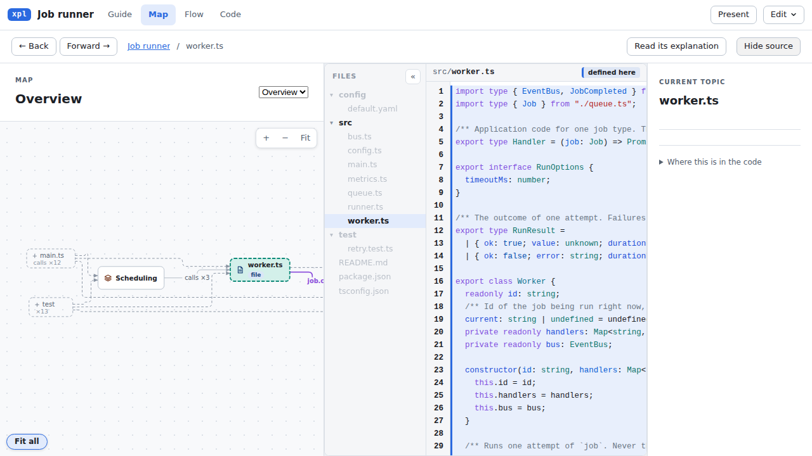
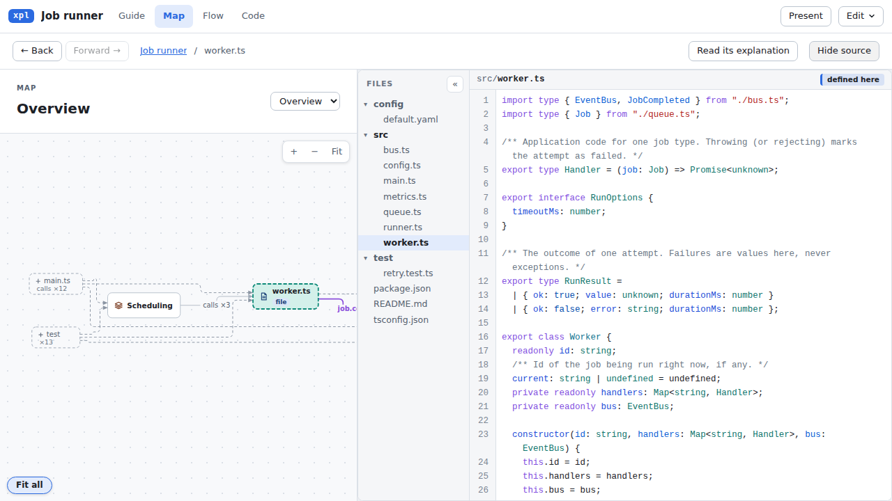
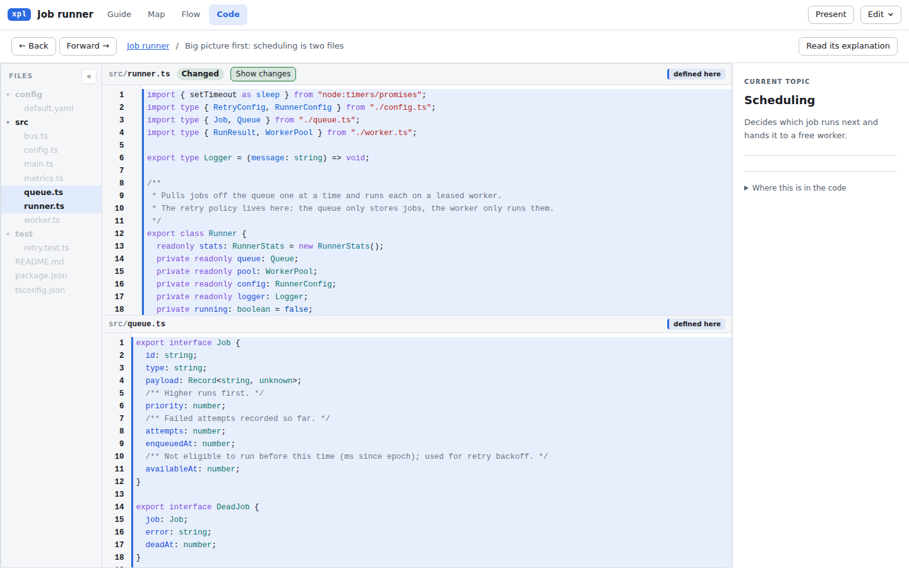
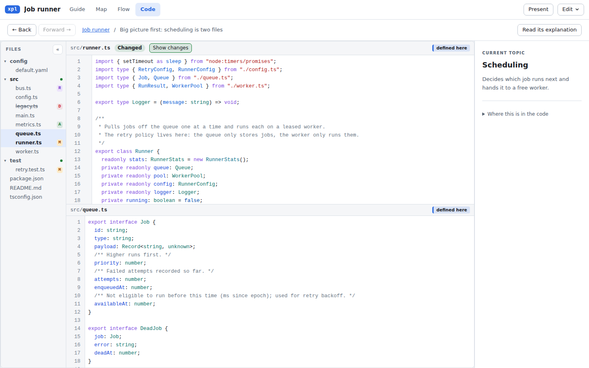
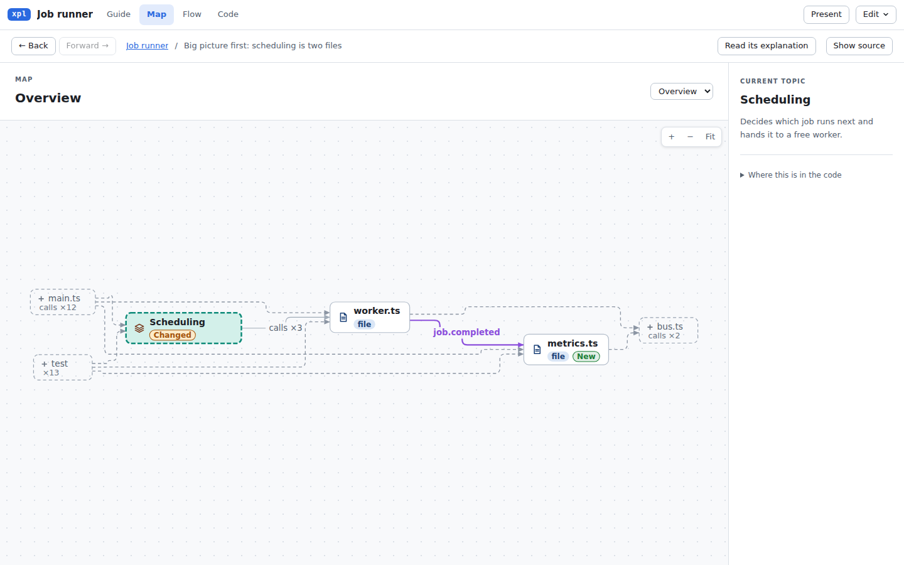
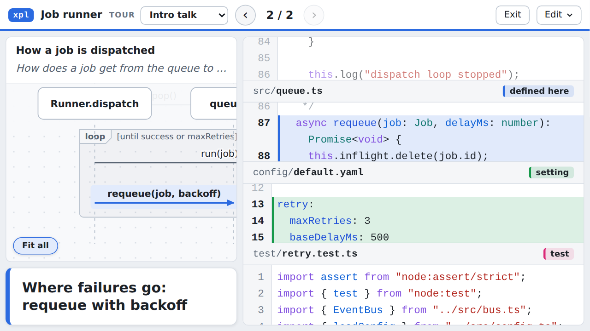

# UI review of the viewer, 2026-10-03

Reviewed: `main` at `5766502`, the viewer only (how a person sees and reads the code). For the explainers
themselves, see [review-2026-10-01.md](review-2026-10-01.md).

## 1. Summary

The links between the text, the diagrams and the code work, and every persona said so. The weak part was
the code itself. It got the smallest share of the screen. Long lines were cut off, and a click in the code
scrolled the start of every line out of view. The dimmed code around the focus was too faint to read, and a
"highlight" could cover a whole file. Change explainers hid most of what had changed.

| Persona                 | Question                               | Rating           |
| ----------------------- | -------------------------------------- | ---------------- |
| Newcomer developer      | How easy is it to see and read code?   | 2 / 5            |
| PR reviewer             | How easy is it to read the change?     | 2.5 / 5          |
| Presenter (1280×720)    | How readable is the code on a screen?  | 3 / 5            |
| Engineering manager     | Could I understand it without help?    | 3 / 5            |
| Designer, accessibility | Visual polish / accessibility          | 3.5 / 5, 2.5 / 5 |

This round fixes the problems that came up in more than one review (section 3). The rest is in section 4.

## 2. What we did

We built the three fixture bundles: the TS job runner, the same with a change, and the Python architecture
overview. `packages/viewer/scripts/ux-shots.ts` took 47 screenshots of them, covering every reading tab,
Explore, Present, a selection, dark mode, and widths of 1440, 1280, 1024, 768 and 390 px. Five persona
reviewers each worked from those screenshots and drove the live page with Playwright on tasks of their own:

- **Newcomer:** "find where a failed job is retried and read it"; "who calls the queue".
- **PR reviewer:** the change bundle. The diff, Before panes, the change list and map badges.
- **Presenter:** every step of both tours at 1280×720, light and dark, at 125% and 150% zoom. A detour, Esc,
  and the browser's Back button.
- **Manager:** the shared HTML link, with no help. The legend, the words used and where to start.
- **Designer:** contrast computed from the CSS variables, a keyboard pass, focus rings, ARIA and narrow
  widths.

The reports are not in the repository. References such as "reviewer §2" point to them.

## 3. Changed in this round

| Finding (who raised it)                                                                                                                                                                                         | Change                                                                                                                                                                                                                                                                                                                     |
| --------------------------------------------------------------------------------------------------------------------------------------------------------------------------------------------------------------- | -------------------------------------------------------------------------------------------------------------------------------------------------------------------------------------------------------------------------------------------------------------------------------------------------------------------------- |
| The code column beside a diagram was 340-430 px, and long lines were cut off (newcomer §1, reviewer §6)                                                                                                        | Beside the explanation, the code gets 3/5 of the width and the topic column folds away below 1680 px. The guide's own table of contents hides while the source is shown. At 1280 px the code column went from about 340 px to about 600 px.                                                                                    |
| A click in the code scrolled every line sideways (newcomer §2)                                                                                                                                                 | Read mode wraps long lines with a hanging indent, as Present already did. Explore keeps code as written.                                                                                                                                                                                                                  |
| Dimmed code was 2.2:1 in light mode (comments 1.6:1). The faint text and tree rows were 1.7-3:1 (designer §1, §4; newcomer §5)                                                                                 | Dimmed lines go from 0.36 to 0.6 opacity (about 4.3:1 light, 6:1 dark). `--faint` is darker (#6b7583, about 4:1). The tree drops its extra 0.55 opacity. Gutter numbers are darker. The focus tint is a little stronger, so it still stands out.                                                                            |
| A file box or group tinted every line of the file "defined here" (newcomer §6, designer §2)                                                                                                                   | A range over the whole file tints and dims nothing. The pane header still names the role.                                                                                                                                                                                                                                 |
| A disabled button (Forward) looked enabled (designer §3)                                                                                                                                                       | `.btn:disabled` is faded, and hover no longer highlights it.                                                                                                                                                                                                                                                             |
| The file tree had no change marks. Bold (focus) read as "changed", and removed files were missing (reviewer §4)                                                                                               | Each changed file has a letter: A new, M changed, R renamed, D removed. The letter is colour plus text, and the tooltip gives the old path and +/- counts. Removed files are listed, struck through, and open as they were. Directories with changes get a dot. Clicking a changed file opens it at its first change.                |
| The map showed one changed file out of five (reviewer §3, manager §2)                                                                                                                                          | A group or directory that covers a changed file gets a "Changed" pill (`changeMarks(..., filesOf)`).                                                                                                                                                                                                                     |
| Present at 150% browser zoom on a 1280 px laptop (853 px) became one scrolling column. The header and step counter went off-screen (presenter §1)                                                              | Present keeps two columns down to 641 px and does not scroll the page between 641 and 900 px.                                                                                                                                                                                                                          |
| Zooming the browser barely enlarged the code in Present (presenter §4)                                                                                                                                         | The code font floor goes from 14 to 15 px.                                                                                                                                                                                                                                                                                 |
| The Map's topic picker was an unstyled 19 px browser control, and the topic column drew two rules with nothing between them (designer)                                                                         | The picker is styled like the tour picker. The topic summary and "Where this is in the code" share one rule.                                                                                                                                                                                                              |

Before and after, at 1280×720 and 1440×900:

Tests: 2115 unit tests and 192 e2e tests pass. Six e2e assertions encoded the old behaviour and were updated:
three expected a whole test file to be tinted, one expected a group with changed files to be unmarked, and two
screenshot tests waited for a tinted line in a whole-file pane.

**Not part of the UI:** `package-lock.json` resolved 68 packages from a private Artifactory mirror, which
`npm ci` cannot reach outside that network. It now points at registry.npmjs.org. The integrity hashes are
unchanged.

## 4. Second round: the open items

The fourteen items this review left open were worked through in three commits on `main`. Each commit was
checked with the typecheck, the unit tests and the e2e suite, and has tests of its own.

| #   | Item (who raised it)                                                                       | What changed                                                                                                                                                                                                         |
| --- | ------------------------------------------------------------------------------------------ | -------------------------------------------------------------------------------------------------------------------------------------------------------------------------------------------------------------------- |
| 1   | Stacked panes were small and fixed (newcomer §3, reviewer §2, presenter §3)                | Each pane header can fold the pane to its name or give it the whole column. A file opened on purpose (the tree, "Files in this change") takes the column until the selection changes. Pane headers are sticky, so a pane scrolled partly away keeps its name in view (Present). |
| 2   | A jump to a change landed short of it (reviewer §1)                                        | Opening a file at a change scrolls the whole change into view, about a third of the way down.                                                                                                                        |
| 3   | No next/previous change (reviewer §5)                                                      | The header of a changed file says "3 changes", then "change 2 / 3", with ‹ › buttons and the keys n / p in the code.                                                                                                 |
| 4   | No search (newcomer §4)                                                                    | Ctrl/Cmd+F finds in a file (`@codemirror/search`, read-only). A filter above the file tree lists the files whose path matches.                                                                                       |
| 5   | No "which function am I in" (newcomer §3)                                                  | The pane header says "in `Runner.dispatch`" when the top of the pane is inside a function whose first line has scrolled away.                                                                                       |
| 6   | No legend; a picked box looked dashed (manager §1)                                         | A "Key" beside the zoom buttons draws each mark the map uses and says what it means, only for the marks on screen. A picked box keeps its solid outline when the map also marks it related.                                    |
| 7   | Cut-off and colliding diagrams (manager §5, newcomer §8-9)                                 | A flow names a loop once, above the arrowhead, on a halo. A guide picture of a sequence keeps the names of the lifelines its step joins. A guide picture cut at a side fades out there, so it reads as "more to see". |
| 8   | The Present caption reflowed on every step (presenter §5)                                  | The caption keeps one height for the whole tour: the tallest step's, measured off-screen, up to its cap. A note longer than the cap still scrolls inside it.                                                         |
| 9   | Jargon (manager §3)                                                                        | "Configured by" is now "Its settings are in". "Inferred relationship" is now "Likely, from how the code is written". "Why these files are linked" is now "Where the code makes this link", with "runner.ts, line 12". "Contains 5 nested elements" is now "Inside it: 5 parts". "calls/extends" is now "calls & extends". |
| 10  | The guide's contents and breadcrumb stayed on step 1 (manager §4)                          | Both follow the section being read as the guide scrolls.                                                                                                                                                             |
| 11  | Keyboard and screen reader (designer §5)                                                   | An edge's accessible name says which two boxes it joins. The breadcrumb is a polite live region. Each editor has an accessible name. The topic column no longer repeats the title and summary under "Where this is in the code", and lists file names instead of cut paths. |
| 12  | Phone width (designer)                                                                     | At 760 px and below, Back and Forward are arrows and the breadcrumb is the topic alone. The tree sits above the code, so the header area went from 166 to 135 px at 390 px, with no sideways scroll.                 |
| 13  | Added lines inside the focus did not look added (reviewer §8)                              | They keep the focus colour and get a green edge on the right, with the + cell.                                                                                                                                      |
| 14  | Present: browser Back left the page; Esc hid the code (presenter)                          | Starting a talk pushes a history entry, so Back leaves the talk. Back in the reading screens, the slide's code stays shown.                                                                                         |

**Third round: what the second round left open**

| Item (who raised it)                                                        | What changed                                                                                                                                                                                              |
| --------------------------------------------------------------------------- | --------------------------------------------------------------------------------------------------------------------------------------------------------------------------------------------------------- |
| Tab reached the map's edges before its boxes (designer §5)                  | The drawn edges stay under the boxes; a keyboard copy of each top-level edge comes after the boxes. It is invisible, lets clicks through, shows a ring on focus, and Enter picks the edge.                   |
| A sequence step in Present could crop the participant (presenter §2)        | The first view frames both ends of the step's arrow when they fit at the readable zoom, and falls back to the label when they do not (`startView`'s `core`), so long sequences still open on their step. |
| The "Before" pane repeated the inline diff (reviewer §7)                    | In Read mode, while the head pane shows the change inline, a Before pane starts folded to its header ("Before (base …)"); one click opens it. Present still shows what the step asks for.                 |
| No "who calls this" (newcomer §4)                                           | The details of a file or a symbol list "Called from": each calling symbol once, at its first call, each row opening the call. Calls from inside the element are left out.                                |
| A double-click did nothing on a guide picture (newcomer §4)                 | A double-click on a guide picture opens it in the Map or the Flow, where boxes open. On the live map, a double-click already opened a group.                                                              |
| No callers of changed code in a change's guide (reviewer §10)               | A guide step of a change lists "Code that calls what changed": callers outside the step of the files and symbols it changed.                                                                              |
| A picked New or Changed box said nothing about the change (reviewer §11)    | Its details say "Added by this change: +36 −0" or "Edited by this change", with "Show the change", which opens the file at its first change inside the element.                                            |

Nothing from the five reviews is left open.

## 5. What works (keep it)

- "Show the code" on a guide step opens exactly the files involved, with plain role chips ("called here",
  "setting", "test").
- A click in the code lights up the arrow it implements, and Back reliably returns to the previous
  selection.
- "Files in this change" is a better PR header than GitHub's: status, renamed-from, tests apart, +/- per
  file.
- Inline removed lines with their real text, and a +/- column for people who do not rely on colour.
- Present: a stray click is one ← away from the step, with the zoom restored. Step changes are instant.
- One set of colour variables for both themes, and visible focus rings on buttons and SVG elements.
